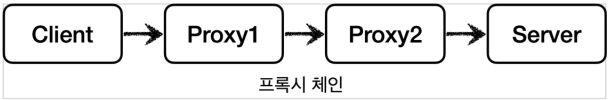
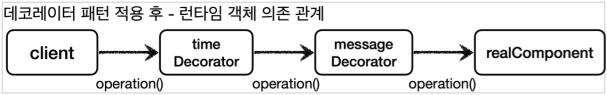
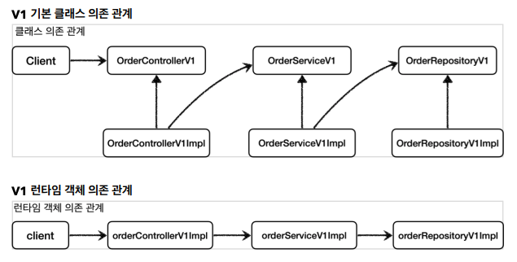

# 프록시 패턴과 데코레이터 패턴

## 프로젝트 생성

### Spring initializer

* https://start.spring.io/
* 프로젝트 선택
    * Project: Gradle - Groovy
    * Language: Java 17
    * Spring Boot: 3.0.3
* Project Metadata
    * Group: hello
    * Artifact: spring-core-advanced-2
    * Packaging: Jar
* Dependencies
    * Spring Web, Lombok

### build.gradle

```gradle
dependencies {
    implementation 'org.springframework.boot:spring-boot-starter-web'
    compileOnly 'org.projectlombok:lombok'
    annotationProcessor 'org.projectlombok:lombok'
    testImplementation 'org.springframework.boot:spring-boot-starter-test'

    // 테스트에서 lombok 사용
    testCompileOnly 'org.projectlombok:lombok'
    testAnnotationProcessor 'org.projectlombok:lombok'
}
```

## 예제 프로젝트 만들기 V1

### 예제는 크게 3가지 상황으로 만든다.

* v1 - 인터페이스와 구현 클래스 - 스프링 빈으로 수동 등록
* v2 - 인터페이스 없는 구체 클래스 - 스프링 빈으로 수동 등록
* v3 - 컴포넌트 스캔으로 스프링 빈 자동 등록

### V1 - 인터페이스와 구현 클래스 - 스프링 빈으로 수동 등록

#### OrderRepository V1

```java
/**
 * OrderRepository 인터페이스<br>
 * - {@link OrderRepositoryV1Impl}
 */
public interface OrderRepositoryV1 {

    /**
     * 저장 로직
     *
     * @param itemId 아이템 ID
     */
    void save(String itemId);
}
```

#### OrderRepository V1 Impl

```java
/**
 * {@link OrderRepositoryV1} 구현체
 */
@Slf4j
public class OrderRepositoryV1Impl implements OrderRepositoryV1 {

    /**
     * 상품 저장 로직
     *
     * @param itemId 상품 ID
     * @throws IllegalStateException itemId.equals("ex")
     */
    @Override
    public void save(String itemId) {
        if (itemId.equals("ex")) {
            throw new IllegalStateException("예외 발생!");
        }
        sleep(1000);
    }

    /**
     * {@link Thread#sleep}, {@link InterruptedException} Wrapper
     *
     * @param millis 중지할 시간
     */
    private void sleep(int millis) {
        try {
            Thread.sleep(millis);
        } catch (InterruptedException e) {
            log.info("", e);
        }
    }
}
```

#### OrderService V1

```java
/**
 * OrderService 인터페이스<br>
 * - {@link OrderServiceV1Impl}
 */
public interface OrderServiceV1 {

    /**
     * 상품 주문 비즈니스 로직
     *
     * @param itemId 상품 ID
     */
    void orderItem(String itemId);
}
```

#### OrderService V1 Impl

```java
/**
 * {@link OrderServiceV1} 구현체
 */
@RequiredArgsConstructor
public class OrderServiceV1Impl implements OrderServiceV1 {
    private final OrderRepositoryV1 orderRepository;

    /**
     * 상품 저장 비즈니스 로직
     *
     * @param itemId 상품 ID
     * @throws IllegalStateException itemId.equals("ex")
     */
    @Override
    public void orderItem(String itemId) {
        orderRepository.save(itemId);
    }
}
```

#### OrderController V1

```java
/**
 * OrderController 인터페이스<br>
 * - {@link OrderControllerV1Impl}<br>
 * - {@link Controller}, {@link RestController}가 없으면 인식 못함
 */
@RestController
@RequestMapping("/v1")
public interface OrderControllerV1 {

    /**
     * GET /v1/request
     *
     * @param itemId 상품 ID
     * @return ECHO 상품 ID
     */
    @GetMapping("/request")
    String request(@RequestParam("itemId") String itemId);

    /**
     * GET /v1/no-log
     *
     * @return "ok"
     */
    @GetMapping("/no-log")
    String noLog();
}
```

* 스프링 부트 3.0 미만
    * `@Controller`, `@RequestMapping`이 있어야 컨트롤러로 인식한다.
* 스프링 부트 3.0 이상
    * `@Controller`, `@RestController`가 있어야 컨트롤러로 인식한다.
    * `@RequestMapping`은 더이상 컨트롤러로 인식하지 않는다.
* `@Controller`, `@RestController`의 경우 `@Component`를 상속받고 있기 때문에, 별도의 설정을 하지않으면 자동으로 스프링 빈에 등록된다.

#### OrderController V1 Impl

```java
/**
 * {@link OrderControllerV1} 구현체<br>
 * - 의존: {@link OrderServiceV1}
 */
@Slf4j
@RequiredArgsConstructor
public class OrderControllerV1Impl implements OrderControllerV1 {
    private final OrderServiceV1 orderService;

    /**
     * GET /v1/request
     *
     * @param itemId 상품 ID
     * @return ECHO 상품 ID
     * @throws IllegalStateException itemId.equals("ex")
     */
    @Override
    public String request(String itemId) {
        orderService.orderItem(itemId);
        return itemId;
    }

    /**
     * GET /v1/no-log
     *
     * @return "noLog ok"
     */
    @Override
    public String noLog() {
        return "noLog ok";
    }
}
```

#### AppV1Config

```java
/**
 * v1<br>
 * 인터페이스와 구현 클래스 - 스프링 빈으로 수동 등록<br><br>
 * <p>
 * 스프링 빈 수동 등록 설정
 */
@Configuration
public class AppV1Config {

    /**
     * @return {@link OrderControllerV1Impl}
     */
    @Bean
    public OrderControllerV1 orderControllerV1() {
        return new OrderControllerV1Impl(orderServiceV1());
    }

    /**
     * @return {@link OrderServiceV1Impl}
     */
    @Bean
    public OrderServiceV1 orderServiceV1() {
        return new OrderServiceV1Impl(orderRepositoryV1());
    }

    /**
     * @return {@link OrderRepositoryV1Impl}
     */
    @Bean
    public OrderRepositoryV1 orderRepositoryV1() {
        return new OrderRepositoryV1Impl();
    }
}
```

#### MainApplication

```java
@Import(AppV1Config.class)
@SpringBootApplication(scanBasePackages = "hello.springcoreadvanced2.app.v3")
public class ProxyApplication { ... }
```

* `@Import`
    * 해당 클래스를 스프링 빈에 등록한다.
    * 일반적으로 `@Configuration`같은 설정 파일을 등록할 때 사용한다.
    * 스프링 빈을 등록할 수도 있다.
* `scanBasePackages`
    * 컴포넌트 스캔 시작 위치 설정

## 예제 프로젝트 만들기 V2

### v2: 인터페이스 없는 구체 클래스 - 스프링 빈으로 수동 등록

#### OrderRepository V2

```java
/**
 * v2<br>
 * 인터페이스 없는 구체 클래스 - 스프링 빈 수동 등록<br><br>
 * 주문 저장소
 */
@Slf4j
public class OrderRepositoryV2 {

    /**
     * 주문 저장 로직
     *
     * @param itemId 상품 ID
     * @throws IllegalStateException itemId.equals("ex")
     */
    public void save(String itemId) {
        if (itemId.equals("ex")) {
            throw new IllegalStateException("예외 발생!");
        }
        sleep(1000);
    }

    /**
     * {@link Thread#sleep}, {@link InterruptedException} Wrapper
     *
     * @param millis 중지할 시간
     */
    private void sleep(int millis) {
        try {
            Thread.sleep(millis);
        } catch (InterruptedException e) {
            log.info("", e);
        }
    }
}
```

#### OrderService V2

```java
/**
 * v2<br>
 * 인터페이스 없는 구체 클래스 - 스프링 빈 수동 등록<br><br>
 * 주문 서비스
 */
@RequiredArgsConstructor
public class OrderServiceV2 {
    private final OrderRepositoryV2 orderRepository;

    /**
     * 주문 저장 비즈니스 로직
     *
     * @param itemId 상품 ID
     * @throws IllegalStateException itemId.equals("ex")
     */
    public void orderItem(String itemId) {
        orderRepository.save(itemId);
    }
}
```

#### OrderController V2

```java
/**
 * v2<br>
 * 인터페이스 없는 구체 클래스 - 스프링 빈 수동 등록<br><br>
 * 주문 컨트롤러
 */
@RestController
@RequestMapping("/v2")
@RequiredArgsConstructor
public class OrderControllerV2 {
    private final OrderServiceV2 orderService;

    /**
     * GET /v2/request
     *
     * @param itemId 상품 ID
     * @return ECHO 상품 ID
     * @throws IllegalStateException itemId.equals("ex")
     */
    @GetMapping("/request")
    public String request(String itemId) {
        orderService.orderItem(itemId);
        return itemId;
    }

    /**
     * GET /v2/no-log
     *
     * @return "noLog ok"
     */
    @GetMapping("no-log")
    public String noLog() {
        return "noLog ok";
    }
}
```

#### AppV2Config

```java
/**
 * v2<br>
 * 인터페이스 없는 구체 클래스 - 스프링 빈 수동 등록<br><br>
 * 스프링 빈 수동 등록 설정
 */
@Configuration
public class AppV2Config {

    @Bean
    public OrderControllerV2 orderControllerV2() {
        return new OrderControllerV2(orderServiceV2());
    }

    @Bean
    public OrderServiceV2 orderServiceV2() {
        return new OrderServiceV2(orderRepositoryV2());
    }

    @Bean
    public OrderRepositoryV2 orderRepositoryV2() {
        return new OrderRepositoryV2();
    }
}
```

#### MainApplication

```java
@Import({AppV1Config.class, AppV2Config.class})
@SpringBootApplication(scanBasePackages = "hello.springcoreadvanced2.app.v3")
public class ProxyApplication { ... }
```

* `@Import({AppV1Config.class, AppV2Config.class})`
    * 두 개 이상의 설정 파일을 등록하기 위해선 배열로 설정하면 된다.

## 예제 프로젝트 만들기 V3

### v3 - 컴포넌트 스캔으로 스프링 빈 자동 등록

#### OrderRepository V3

```java
/**
 * v3<br>
 * 컴포넌트 스캔으로 스프링 빈 자동 등록<br><br>
 * 주문 저장소
 */
@Slf4j
@Repository
public class OrderRepositoryV3 {

    /**
     * 주문 저장 로직
     *
     * @param itemId 상품 ID
     * @throws IllegalStateException itemId.equals("ex")
     */
    public void save(String itemId) {
        if (itemId.equals("ex")) {
            throw new IllegalStateException("예외 발생!");
        }
        sleep(1000);
    }

    /**
     * {@link Thread#sleep}, {@link InterruptedException} Wrapper
     *
     * @param millis 중지할 시간
     */
    private void sleep(int millis) {
        try {
            Thread.sleep(millis);
        } catch (InterruptedException e) {
            log.info("", e);
        }
    }
}
```

#### OrderService V3

```java
/**
 * v3<br>
 * 컴포넌트 스캔으로 스프링 빈 자동 등록<br><br>
 * 주문 서비스
 */
@Service
@RequiredArgsConstructor
public class OrderServiceV3 {
    private final OrderRepositoryV3 orderRepository;

    /**
     * 주문 저장 비즈니스 로직
     *
     * @param itemId 상품 ID
     * @throws IllegalStateException itemId.equals("ex")
     */
    public void orderItem(String itemId) {
        orderRepository.save(itemId);
    }
}
```

#### OrderController V3

```java
/**
 * v3<br>
 * 컴포넌트 스캔으로 스프링 빈 자동 등록<br><br>
 * 주문 컨트롤러
 */
@RestController
@RequestMapping("/v3")
@RequiredArgsConstructor
public class OrderControllerV3 {
    private final OrderServiceV3 orderService;

    /**
     * GET /v3/request
     *
     * @param itemId 상품 ID
     * @return ECHO 상품 ID
     * @throws IllegalStateException itemId.equals("ex")
     */
    @GetMapping("/request")
    public String request(String itemId) {
        orderService.orderItem(itemId);
        return itemId;
    }

    /**
     * GET /v3/no-log
     *
     * @return "noLog ok"
     */
    @GetMapping("no-log")
    public String noLog() {
        return "noLog ok";
    }
}
```

## 요구사항 추가

* 원본 코드를 전혀 수정하지 않고, 로그 추적기를 적용해라.
* 특정 메서드는 로그를 출력하지 않는 기능
    * 보안상 일부는 로그를 출력하면 안된다.
* 다음과 같은 다양한 케이스에 적용할 수 있어야 한다.
    * v1 - 인터페이스가 있는 구현 클래스에 적용
    * v2 - 인터페이스가 없는 구체 클래스에 적용
    * v3 - 컴포넌트 스캔 대상에 기능 적용

가장 어려운 문제는 원본 코드를 전혀 수정하지 않고, 로그 추적기를 도입하는 것이다.
이 문제를 해결하려면 **프록시**(`Proxy`)의 개념을 먼저 이해해야 한다.

## 프록시, 프록시 패턴, 데코레이터 패턴 - 소개

### 프록시

#### 클라이언트와 서버


클라이언트(`Client`)와 서버(`Server`)라고 하면 개발자들은 보통 서버 컴퓨터를 생각한다.

사실 클라이언트와 서버의 개념은 상당히 넓게 사용된다.
클라이언트는 의뢰인이라는 뜻이고, 서버는 '서비스나 상품을 제공하는 사람이나 물건'을 뜻한다.

따라서 클라이언트와 서버의 기본 개념을 정의하면 **클라이언트는 서버에 필요한 것을 요청하고, 서버는 클라이언트의 요청을 처리**하는 것이다.

이 개념을 우리가 익숙한 컴퓨터 네트워크에 도입하면 클라이언트는 웹 브라우저가 되고, 요청을 처리하는 서버는 웹 서버가 된다.
이 개념을 객체에 도입하면, 요청하는 객체는 클라이언트가 되고, 요청을 처리하는 객체는 서버가 된다.

#### 직접 호출


클라이언트와 서버 개념에서 일반적으로 클라이언트가 서버를 직접 호출하고, 처리 결과를 직접 받는다.
이것을 직접 호출이라 한다.

#### 간접 호출


그런데 클라이언트가 요청한 결과를 서버에 직접 요청하는 것이 아니라 어떤 대리자를 통해서 대신 간접적으로 서버에 요청할 수 있다.
예를 들어서 내가 직접 마트에서 장을 볼 수도 있지만, 누군가에게 대신 장을 봐달라고 부탁할 수도 있다.

여기서 대신 장을 보는 **대리자**를 영어로 **프록시**(`Proxy`)라 한다.

#### 기능

* 접근 제어, 캐싱
* 부가 기능 추가
* 프록시 체인



#### 서버와 프록시가 같은 인터페이스 사용


객체에서 프록시가 되려면, 클라이언트는 서버에게 요청을 한 것인지, 프록시에게 요청을 한 것인지 조차 몰라야 한다.

쉽게 이야기해서 **서버와 프록시는 같은 인터페이스를 사용**해야 한다.
그리고 클라이언트가 사용하는 서버 객체를 프록시 객체로 변경해도 클라이언트 코드를 변경하지 않고 동작할 수 있어야 한다.

클래스 의존관계를 보면 클라이언트는 서버 인터페이스에만 의존한다.
그리고 서버와 프록시가 같은 인터페이스를 사용한다. 따라서 DI를 사용해서 대체 가능하다.

#### 런타임 객체 의존 관계


런타임(애플리케이션 실행 시점)에 클라이언트 객체에 DI를 사용해서
`Client -> Server`에서 `Client -> Proxy`로 객체 의존관계를 변경해도 클라이언트 코드를 전혀 변경하지 않아도 된다.

클라이언트 입장에서는 변경 사실 조차 모른다. DI를 사용하면 클라이언트 코드의 변경 없이 유연하게 프록시를 주입할 수 있다.

#### 프록시의 주요 기능

* 접근 제어
    * 권한에 따른 접근 차단 - `Authorization`
    * 캐싱 - `Caching`
    * 지연 로딩 - `Lazy Loading`
* 부가 기능 추가
    * 원래 서버가 제공하는 기능에 더해서 부가 기능을 수행한다.
    * 값을 검증한다. - `Validated`
    * 요청 값이나 응답 값을 중간에 변형한다. - `Converter`, `Formatter`
    * 실행 시간을 측정해서 추가 로그를 남긴다. - `Log`

#### GOF 디자인 패턴

둘다 프록시를 사용하는 방법이지만, 이 둘을 의도(intent)에 따라서 프록시 패턴과 데코레이터 패턴으로 구분한다.

* **프록시 패턴**: 접근 제어가 목적
* **데코레이터 패턴**: 새로운 기능 추가가 목적

둘다 프록시를 사용하지만, **의도가 다르다**는 점이 핵심이다.
용어가 프록시 패턴이라고 해서 이 패턴만 프록시를 사용하는 것은 아니다. 데코레이터 패턴도 프록시를 사용한다.

> 참고<br>
> 프록시라는 개념은 클라이언트 서버라는 큰 개념안에서 자연스럽게 발생할 수 있다.
> 프록시는 객체안에서의 개념도 있고, 웹 서버에서의 프록시도 있다.
> 객체안에서 객체로 구현되어있는가, 웹 서버로 구현되어 있는가 처럼 규모의 차이가 있을 뿐 근본적인 역할은 같다.

## 프록시 패턴 - 예제 코드 1

### 예제

#### 그림


#### Subject

```java
/**
 * 프록시 객체<br>
 * - 구현체: {@link RealSubject}
 */
public interface Subject {

    /**
     * 실제로 실행되는 메서드
     */
    String operation();
}
```

#### RealSubject

```java
/**
 * 프록시 객체 {@link Subject}의 구현체
 */
@Slf4j
public class RealSubject implements Subject {

    /**
     * 실제 객체 호출<br>
     * - <code>Thread.sleep(1000)</code>
     */
    @Override
    public String operation() {
        log.info("실제 객체 호출");
        SleepWrapper.sleep(1000);
        return "data";
    }
}
```

#### Client

```java
/**
 * 프록시를 호출하는 Client<br>
 * - 의존: {@link Subject}
 */
@RequiredArgsConstructor
public class Client {
    private final Subject subject;

    /**
     * 프록시 호출
     */
    public void execute() {
        subject.operation();
    }
}
```

#### ProxyPattern Test

```java
/**
 * {@link Subject}, {@link RealSubject}, {@link Client} Test
 */
public class ProxyPatternTest {

    /**
     * 프록시 클라이언트를 단순히 3번 호출한다.
     * <p>
     * RealSubject는 호출당 1초씩 걸리기 때문에 총 소요시간은 3초가 된다.
     */
    @Test
    void noProxyTest() {
        Subject realSubject = new RealSubject();
        Client client = new Client(realSubject);

        client.execute();
        client.execute();
        client.execute();
    }
}
```

## 프록시 패턴 - 예제 코드 2

### 프록시 패턴 적용


### 예제

#### CacheProxy

```java
/**
 * 캐싱 프록시 객체
 */
@Slf4j
public class CacheProxy implements Subject {

    /**
     * 목표: {@link Subject} 구현체
     */
    private final Subject target;

    /**
     * 캐시값
     * - 초기값: null
     */
    private String cacheValue;

    /**
     * @param target 목표 Subject
     */
    public CacheProxy(Subject target) {
        this.target = target;
    }

    /**
     * 프록시 객체가 {@link #target}을 대신 호출해줌.<br>
     * {@link #target}의 값을 Caching 한다.<br><br>
     *
     * <code>cacheValue == null: {@link #target}.operation()</code><br>
     * <code>cacheValue != null: {@link #cacheValue}</code>
     */
    @Override
    public String operation() {
        log.info("프록시 호출");
        if (cacheValue == null) {
            cacheValue = target.operation();
        }
        return cacheValue;
    }
}
```

#### ProxyPatternTest

```java
/**
 * {@link Client}가 3번 호출되지만,
 * {@link RealSubject}가 아닌 {@link CacheProxy}가 대신 호출됨.
 * <p>
 * {@link CacheProxy}는 최초 한 번 {@link RealSubject}을 호출하고,
 * 그 이후에는 캐싱된 {@link RealSubject}의 결과값을 반환.
 * <p>
 * 결과적으로 총 [1 ~ 1.5초]의 시간이 소모된다.
 */
@Test
void cacheProxyTest() {
    RealSubject realSubject = new RealSubject();
    CacheProxy cacheProxy = new CacheProxy(realSubject);
    Client client = new Client(cacheProxy);

    client.execute();
    client.execute();
    client.execute();
}
```

### 테스트 결과

```
15:14:01.992 [main] CacheProxy - 프록시 호출
15:14:01.995 [main] RealSubject - 실제 객체 호출
15:14:03.000 [main] CacheProxy - 프록시 호출
15:14:03.001 [main] CacheProxy - 프록시 호출

총 [1009 ms] 소요 
```

## 데코레이터 패턴 - 예제 코드 1

### 적용 전 예제

#### 그림


#### Component

```java
/**
 * Component 인터페이스<br>
 * - 구현체: {@link RealComponent}
 */
public interface Component {

    /**
     * 실행을 원하는 메서드
     */
    String operation();
}
```

#### RealComponent

```java
/**
 * 실제 {@link Component} 구현체
 */
@Slf4j
public class RealComponent implements Component {

    /**
     * 실제로 실행되는 메서드
     *
     * @return "data"
     */
    @Override
    public String operation() {
        log.info("RealComponent 실행");
        return "data";
    }
}
```

#### Client

```java
/**
 * {@link Component}를 사용하는 Client
 */
@Slf4j
@RequiredArgsConstructor
public class Client {
    private final Component component;

    /**
     * Client 실행
     * <p>
     * {@link Component#operation()}의 반환값을 받아서 화면에 출력한다.
     */
    public void execute() {
        String result = component.operation();
        log.info("result = [{}]", result);
    }
}
```

#### DecoratorPatternTest

```java
/**
 * {@link Component}, {@link RealComponent}, {@link Client} Test
 */
@Slf4j
public class DecoratorPatternTest {

    /**
     * 일반적인 호출
     * <p>
     * 결과로 {@link RealComponent#operation()}이 호출된다.
     */
    @Test
    void noDecorator() {
        Component realComponent = new RealComponent();
        Client client = new Client(realComponent);

        client.execute();
    }
}
```

## 데코레이터 패턴 - 예제 코드 2

### 데코레이터 패턴의 기능

#### 부가 기능 추가

* 데코레이터 패턴: 원래 서버가 제공하는 기능에 더해서 부가 기능을 수행한다.
    * 요청 값이나, 응답 값을 중간에 변형한다. (Converter, Formatter)
    * 실행 시간을 측정해서 추가 로그를 남긴다. (Log)

### 응답 값을 꾸며주는 데코레이터


#### MessageDecorator

```java
/**
 * {@link Component}를 상속받는 메시지 데코레이터
 */
@Slf4j
@RequiredArgsConstructor
public class MessageDecorator implements Component {

    /**
     * 목표 {@link Component} 구현체
     */
    private final Component target;

    /**
     * 메시지 데코레이터 실행
     *
     * @return "=== " + {@link #target}.operation() + " ===";
     */
    @Override
    public String operation() {
        log.info("MessageDecorator 실행");

        String result = target.operation();
        String decoResult = "=== " + result + " ===";
        log.info("꾸미기 적용 전 = [{}], 적용 후 = [{}]", result, decoResult);

        return decoResult;
    }
}
```

#### DecoratorPatternTest

```java
/**
 * 메시지 데코레이터 호출
 * <p>
 * 결과로 {@link MessageDecorator#operation()}이 호출된다.
 */
@Test
void decorator1() {
    Component realComponent = new RealComponent();
    Component decorator = new MessageDecorator(realComponent);
    Client client = new Client(decorator);

    client.execute();
}
```

#### 결과 로그

```
MessageDecorator - MessageDecorator 실행
   RealComponent - RealComponent 실행
MessageDecorator - 꾸미기 적용 전 = [data], 적용 후 = [=== data ===]
          Client - result = [=== data ===]
```

## 데코레이터 패턴 - 예제 코드 3

### 실행 시간을 측정하는 데코레이터


#### 체이닝 - Chaining



### 예제

#### TimeDecorator

```java
/**
 * {@link Component}를 상속받는 시간 Decorator
 */
@Slf4j
@RequiredArgsConstructor
public class TimeDecorator implements Component {
    private final Component component;

    /**
     * 현재 {@link Component} Decorator 부터 하위 Decorator 까지의 총 소모 시간을 구하는 메서드
     *
     * @return 이후 {@link Component} 체이닝의 총 소모 시간
     */
    @Override
    public String operation() {
        log.info("TimeDecorator 실행");

        long startTime = System.currentTimeMillis();

        String result = component.operation();

        long endTime = System.currentTimeMillis();
        long resultTime = endTime - startTime;
        log.info("TimeDecorator 종료 resultTime = [{}ms]", resultTime);

        return result;
    }
}
```

#### DecoratorPatternTest

```java
/**
 * 데코레이터 체이닝
 * <p>
 * {@link Client} -> {@link TimeDecorator} -> {@link MessageDecorator} -> {@link RealComponent}
 */
@Test
void decorator2() {
    Component realComponent = new RealComponent();
    Component messageDecorator = new MessageDecorator(realComponent);
    Component timeDecorator = new TimeDecorator(messageDecorator);
    Client client = new Client(timeDecorator);

    client.execute();
}
```

#### 결과 로그

```
   TimeDecorator - TimeDecorator 실행
MessageDecorator - MessageDecorator 실행
   RealComponent - RealComponent 실행
MessageDecorator - 꾸미기 적용 전 = [data], 적용 후 = [=== data ===]
   TimeDecorator - TimeDecorator 종료 resultTime = [3ms]
          Client - result = [=== data ===]
```

## 프록시 패턴과 데코레이터 패턴 정리

### GOF 데코레이터 패턴



여기서 생각해보면 `Decorator`기능에 일부 중복이 있다.

꾸며주는 역할을 하는 `Decorator`들은 스스로 존재할 수 없다.
항상 꾸며줄 대상이 있어야 한다.
따라서 내부에 호출 대상인 `component`를 가지고 있어야 한다.
그리고 `component`를 항상 호출해야 한다.

이 부분이 중복이다.
이런 중복을 제거하기 위해 `component`를 속성으로 가지고 있는 `Decorator`라는 추상 클래스를 만드는 방법도 고민할 수 있다.
이렇게 하면 추가로 클래스 다이어그램에서 어떤 것이 실제 컴포넌트 인지, 데코레이터인지 명확하게 구분할 수 있다.

여기까지 고민한 것이 바로 **GOF에서 설명하는 데코레이터 패턴의 기본 예제**이다.

### 프록시 패턴 vs 데코레이터 패턴

#### 의도(intent)

* 프록시 패턴의 의도
    * 다른 개체에 대한 **접근을 제어**하기 위해 대리자를 제공
* 데코레이터 패턴의 의도
    * **객체에 추가 책임(기능)을 동적으로 추가**하고, 기능 확장을 위한 유연한 대안 제공

### 정리

| Pattern | Proxy | Decorator |
|---------|-------|-----------|
| 의도      | 접근 제어 | 새로운 기능 추가 |

## 인터페이스 기반 프록시 - 적용

### 기존의 V1 의존 관계


### 프록시 추가 후 의존 관계


### 예제

#### OrderRepositoryInterfaceProxy

```java
/**
 * {@link OrderRepositoryV1} Proxy
 */
@RequiredArgsConstructor
public class OrderRepositoryInterfaceProxy implements OrderRepositoryV1 {

    private final OrderRepositoryV1 target;
    private final LogTrace logTrace;

    @Override
    public void save(String itemId) {
        TraceStatus status = null;

        try {
            status = logTrace.begin("OrderRepository.save()");

            target.save(itemId);

            logTrace.end(status);
        } catch (Exception e) {
            logTrace.exception(status, e);
            throw e;
        }
    }
}
```

#### OrderServiceInterfaceProxy

```java
/**
 * {@link OrderServiceV1} Proxy
 */
@RequiredArgsConstructor
public class OrderServiceInterfaceProxy implements OrderServiceV1 {

    private final OrderServiceV1 target;
    private final LogTrace logTrace;

    @Override
    public void orderItem(String itemId) {
        TraceStatus status = null;

        try {
            status = logTrace.begin("OrderService.save()");

            target.orderItem(itemId);

            logTrace.end(status);
        } catch (Exception e) {
            logTrace.exception(status, e);
            throw e;
        }
    }
}
```

#### OrderControllerInterfaceProxy

```java
/**
 * {@link OrderControllerV1} Proxy
 */
@RequiredArgsConstructor
public class OrderControllerInterfaceProxy implements OrderControllerV1 {

    private final OrderControllerV1 target;
    private final LogTrace logTrace;

    @Override
    public String request(String itemId) {
        TraceStatus status = null;

        try {
            status = logTrace.begin("OrderController.save()");

            String result = target.request(itemId);

            logTrace.end(status);
            return result;
        } catch (Exception e) {
            logTrace.exception(status, e);
            throw e;
        }
    }

    @Override
    public String noLog() {
        return target.noLog();
    }
}
```

#### InterfaceProxyConfig

```java
/**
 * V1 Proxy Configuration
 */
@Configuration
public class InterfaceProxyConfig {

    /**
     * @return {@link OrderControllerInterfaceProxy}
     */
    @Bean
    public OrderControllerV1 orderController(LogTrace logTrace) {
        OrderControllerV1Impl controllerImpl = new OrderControllerV1Impl(orderService(logTrace));
        return new OrderControllerInterfaceProxy(controllerImpl, logTrace);
    }

    /**
     * @return {@link OrderServiceInterfaceProxy}
     */
    @Bean
    public OrderServiceV1 orderService(LogTrace logTrace) {
        OrderServiceV1Impl serviceImpl = new OrderServiceV1Impl(orderRepository(logTrace));
        return new OrderServiceInterfaceProxy(serviceImpl, logTrace);
    }

    /**
     * @return {@link OrderRepositoryInterfaceProxy}
     */
    @Bean
    public OrderRepositoryV1 orderRepository(LogTrace logTrace) {
        OrderRepositoryV1Impl repositoryImpl = new OrderRepositoryV1Impl();
        return new OrderRepositoryInterfaceProxy(repositoryImpl, logTrace);
    }
}
```

#### MainApplication

```java
@Import(InterfaceProxyConfig.class)
@SpringBootApplication(scanBasePackages = "hello.springcoreadvanced2.app.v3")
public class ProxyApplication {

    public static void main(String[] args) {
        SpringApplication.run(ProxyApplication.class, args);
    }

    @Bean
    public LogTrace logTrace() {
        return new ThreadLocalLogTrace();
    }
}
```

### 정리

#### 프록시 적용 전


#### 프록시 적용 후


* 스프링 컨테이너에 프록시 객체가 등록된다.
    * 스프링 컨테이너는 이제 실제 객체가 아니라 프록시 객체를 스프링 빈으로 관리한다.
* 이제 실제 객체는 스프링 컨테이너와는 상관이 없다. 실제 객체는 프록시 객체를 통해서 참조될 뿐이다.
* 프록시 객체는 스프링 컨테이너가 관리하고 자바 힙 메모리에도 올라간다.
    * 반면에 실제 객체는 자바 힙 메모리에는 올라가지만 스프링 컨테이너가 관리하지는 않는다.

## 구체 클래스 기반 프록시 - 예제 1

## 구체 클래스 기반 프록시 - 예제 2

## 구체 클래스 기반 프록시 - 적용

## 인터페이스 기반 프록시와 클래스 기반 프록시