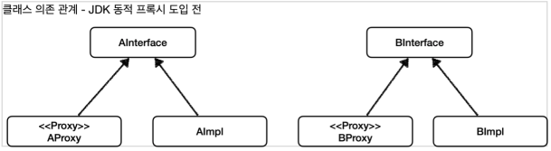
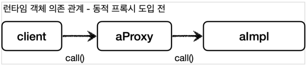
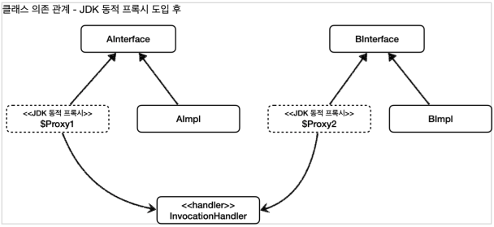
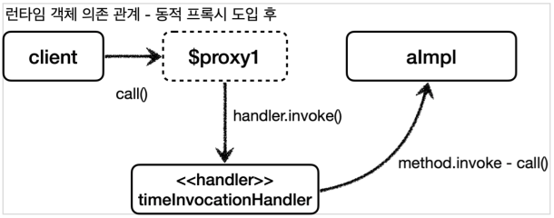
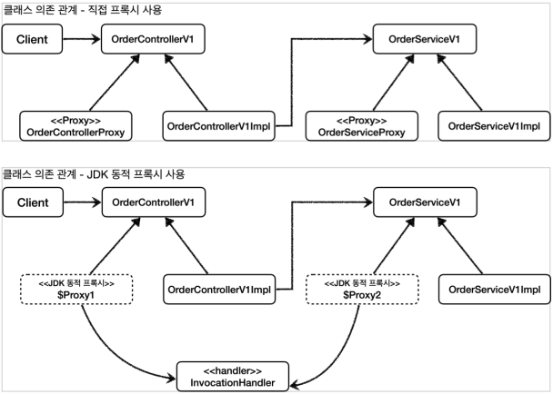
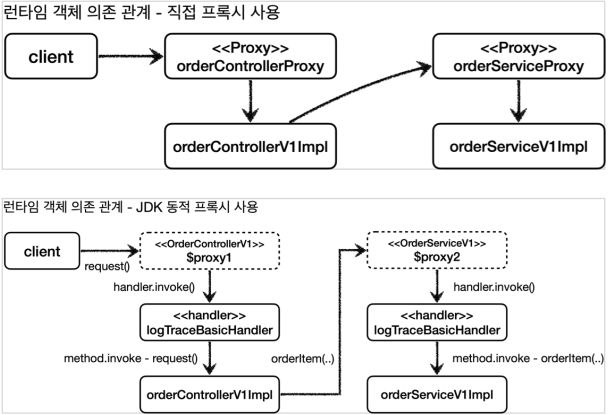

# 동적 프록시 기술

## 리플렉션

### 리플렉션

자바가 기본으로 제공하는 `JDK` 동적 프록시 기술이나 `CGLIB`같은 프록시 생성 오픈소스 기술을 활용하면 프록시 객체를 동적으로 만들어낼 수 있다.
쉽게 이야기해서 프록시 클래스를 지금처럼 계속 만들지 않아도 된다는 것이다.
프록시를 적용할 코드를 하나만 만들어두고 동적 프록시 기술을 사용해서 프록시 객체를 찍어내면 된다.
자세한 내용은 조금 뒤에 코드로 확인해보자.

JDK 동적 프록시를 이해하기 위해서는 먼저 자바의 리플렉션 기술을 이해해야 한다.
리플렉션 기술을 사용하면 **클래스나 메서드의 메타정보를 동적으로 획득**하고, **코드도 동적으로 호출**할 수 있다.

### 리플렉션 적용 전

#### ReflectionTest

```java
@Slf4j
public class ReflectionTest {

    /**
     * 공통 로직 1과 공통 로직 2는 호출하는 메서드만 다르고 전체 코드 흐름이 완전히 같다.
     */
    @Test
    void reflection0() {
        Hello target = new Hello();

        // 공통 로직 1 시작
        log.info("start");
        String result1 = target.callA();
        log.info("result1 = {}", result1);
        // 공통 로직 1 종료

        // 공통 로직 2 시작
        log.info("start");
        String result2 = target.callB();
        log.info("result2 = {}", result2);
        // 공통 로직 2 종료
    }

    @Slf4j
    static class Hello {
        public String callA() {
            log.info("callA");
            return "A";
        }

        public String callB() {
            log.info("callB");
            return "B";
        }
    }
}
```

여기서 공통 로직1과 공통 로직 2를 하나의 메서드로 뽑아서 합칠 수 있을까?

호출하는 메서드인 `target.callA()`, `target.callB()` 이 부분만 동적으로 처리할 수 있다면 문제를 해결할 수 있을 듯 하다.

### 리플렉션 적용

#### ReflectionTest

```java
/**
 * 리플렉션을 사용하여 메서드를 동적으로 호출
 */
@Test
void reflection1() throws Exception {
    Class<?> classHello = Class.forName("hello.springcoreadvanced2.jdkdynamic.ReflectionTest$Hello");

    Hello target = new Hello();

    Method methodCallA = classHello.getMethod("callA");
    Object result1 = methodCallA.invoke(target);
    log.info("result1 = {}", result1);

    Method methodCallB = classHello.getMethod("callB");
    Object result2 = methodCallB.invoke(target);
    log.info("result2 = {}", result2);
}
```

* `Class.forName("hello.proxy.jdkdynamic.ReflectionTest$Hello")`
    * 클래스 메타정보를 획득한다. 참고로 내부 클래스는 구분을 위해 `$`를 사용한다.
* `classHello.getMethod("call")`
    * 해당 클래스의 `call` 메서드 메타정보를 획득한다.
* `methodCallA.invoke(target)`
    * 획득한 메서드 메타정보로 실제 인스턴스의 메서드를 호출한다.
    * 여기서 `methodCallA`는 `Hello` 클래스의 `callA()` 이라는 메서드 메타정보이다.
    * `methodCallA.invoke(인스턴스)`를 호출하면서 인스턴스를 넘겨주면 해당 인스턴스의 `callA()` 메서드를 찾아서 실행한다.
    * 여기서는 `target`의 `callA()` 메서드를 호출한다.

### 리플렉션 적용 - 공통 로직 메서드

#### ReflectionTest

```java
/**
 * 위의 예제에서 invoke 부분을 공통 메서드로 빼버렸다.
 */
@Test
void reflection2() throws Exception {
    Class<?> classHello = Class.forName("hello.springcoreadvanced2.jdkdynamic.ReflectionTest$Hello");
    Hello target = new Hello();

    Method methodCallA = classHello.getMethod("callA");
    dynamicCall(methodCallA, target);

    Method methodCallB = classHello.getMethod("callB");
    dynamicCall(methodCallB, target);
}

private void dynamicCall(Method method, Object target) throws Exception {
    log.info("start");
    Object result = method.invoke(target);
    log.info("result = {}", result);
}
```

* `dynamicCall(Method method, Object target)`
    * 공통 로직1, 공통 로직2를 한번에 처리할 수 있는 통합된 공통 처리 로직이다.
* `Method method`
    * 첫 번째 파라미터는 호출할 메서드 정보가 넘어온다. 이것이 핵심이다.
    * 기존에는 메서드 이름을 직접 호출했지만, 이제는 `Method`라는 메타정보를 통해서 호출할 메서드 정보가 동적으로 제공된다.
* `Object target`
    * 실제 실행할 인스턴스 정보가 넘어온다.
    * 타입이 `Object`라는 것은 어떠한 인스턴스도 받을 수 있다는 뜻이다.
    * 물론 `method.invoke(target)`를 사용할 때 호출할 클래스와 메서드 정보가 서로 다르면 예외가 발생한다.

### 정리

정적인 `target.callA()`, `target.callB()` 코드를 리플렉션을 사용해서 Method 라는 메타정보로 추상화했다.
덕분에 공통 로직을 만들 수 있게 되었다.

### 주의

리플렉션을 사용하면 클래스와 메서드의 메타정보를 사용해서 애플리케이션을 동적으로 유연하게 만들 수 있다.
하지만 리플렉션 기술은 런타임에 동작하기 때문에, 컴파일 시점에 오류를 잡을 수 없다.

예를 들어서 지금까지 살펴본 코드에서 `getMethod("callA")`안에 들어가는 문자를 실수로 `getMethod("callZ")`로 작성해도 컴파일 오류가 발생하지 않는다.
그러나 해당 코드를 직접 실행하는 시점에 발생하는 오류인 런타임 오류가 발생한다.

가장 좋은 오류는 개발자가 즉시 확인할 수 있는 컴파일 오류이고, 가장 무서운 오류는 사용자가 직접 실행할 때 발생하는 런타임 오류다.

따라서 리플렉션은 일반적으로 사용하면 안된다.
지금까지 프로그래밍 언어가 발달하면서 타입 정보를 기반으로 컴파일 시점에 오류를 잡아준 덕분에 개발자가 편하게 살았는데,
리플렉션은 그것에 역행하는 방식이다.

리플렉션은 프레임워크 개발이나 또는 매우 일반적인 공통 처리가 필요할 때 부분적으로 주의해서 사용해야 한다.

## JDK 동적 프록시 - 소개

### 동적 프록시

동적 프록시 기술을 사용하면 개발자가 직접 프록시 클래스를 만들지 않아도 된다.
이름 그대로 프록시 객체를 동적으로 런타임에 개발자 대신 만들어준다.
그리고 동적 프록시에 원하는 실행 로직을 지정할 수 있다.

> **주의**<br>
> JDK 동적 프록시는 인터페이스를 기반으로 프록시를 동적으로 만들어준다.
> 따라서 인터페이스가 필수이다.

### 기본 예제 코드

#### AInterface

```java
public interface AInterface {
    String call();
}
```

#### AImpl

```java
@Slf4j
public class AImpl implements AInterface {
    @Override
    public String call() {
        log.info("A 호출");
        return "A";
    }
}
```

#### BInterface

```java
public interface BInterface {
    String call();
}
```

#### BImpl

```java
@Slf4j
public class BImpl implements BInterface {
    @Override
    public String call() {
        log.info("B 호출");
        return "B";
    }
}
```

## JDK 동적 프록시 - 예제 코드

### JDK 동적 프록시 InvocationHandler

#### InvocationHandler

```java
package java.lang.reflect;

public interface InvocationHandler {
    public Object invoke(Object proxy, Method method, Object[] args) throws Throwable;
}
```

* `Object proxy`: 프록시 자신
* `Method method`: 호출한 메서드
* `Object[] args`: 메서드를 호출할 때 전달한 인수

### 예제

#### TimeInvocationHandler

```java
/**
 * {@link InvocationHandler}를 상속받은 시간 Proxy Handler
 */
@Slf4j
@RequiredArgsConstructor
public class TimeInvocationHandler implements InvocationHandler {
    private final Object target;

    /**
     * 실행되는 로직
     */
    @Override
    public Object invoke(
            Object proxy,
            Method method,
            Object[] args
    ) throws Throwable {
        log.info("TimeProxy 실행");
        long startTime = System.currentTimeMillis();

        Object result = method.invoke(target, args);

        long endTime = System.currentTimeMillis();
        long resultTime = endTime - startTime;
        log.info("TimeProxy 종료 resultTime = [{}ms]", resultTime);

        return result;
    }
}
```

* `TimeInvocationHandler`은 `InvocationHandler`인터페이스를 구현한다.
    * 이렇게해서 JDK 동적 프록시에 적용할 공통 로직을 개발할 수 있다.
* `Object target`
    * 동적 프록시가 호출할 대상
* `method.invoke(target, args)`
    * 리플렉션을 사용해서 `target` 인스턴스의 메서드를 실행한다.
    * `args`는 메서드 호출시 넘겨줄 인수이다.

### 테스트

#### JdkDynamicProxyTest

```java
/**
 * {@link TimeInvocationHandler} Test
 */
@Slf4j
public class JdkDynamicProxyTest {

    @Test
    void dynamicA() {
        AInterface target = new AImpl();
        TimeInvocationHandler handler = new TimeInvocationHandler(target);
        AInterface proxy = (AInterface) Proxy.newProxyInstance(
                AInterface.class.getClassLoader(),
                new Class[]{AInterface.class},
                handler
        );

        proxy.call();

        log.info("targetClass = {}", target.getClass());
        log.info("proxyClass = {}", proxy.getClass());
    }

    @Test
    void dynamicB() {
        BInterface target = new BImpl();
        TimeInvocationHandler handler = new TimeInvocationHandler(target);
        BInterface proxy = (BInterface) Proxy.newProxyInstance(
                BInterface.class.getClassLoader(),
                new Class[]{BInterface.class},
                handler
        );

        proxy.call();

        log.info("targetClass = {}", target.getClass());
        log.info("proxyClass = {}", proxy.getClass());
    }
}
```

* `new TimeInvocationHandler(target)`
    * 동적 프록시에 적용할 핸들러 로직이다.
* `Proxy.newProxyInstance(AInterface.class.getClassLoader(), new Class[]{AInterface.class}, handler)`
    * 동적 프록시는 `java.lang.reflect.Proxy`를 통해서 생성할 수 있다.
    * 클래스 로더 정보, 인터페이스, 그리고 핸들러 로직을 넣어주면 된다.
    * 그러면 해당 인터페이스를 기반으로 동적 프록시를 생성하고 그 결과를 반환한다.

#### 실행 결과

```
TimeInvocationHandler - TimeProxy 실행
                AImpl - A 호출
TimeInvocationHandler - TimeProxy 종료 resultTime = [1ms]
  JdkDynamicProxyTest - targetClass = class hello.springcoreadvanced2.jdkdynamic.code.AImpl
  JdkDynamicProxyTest - proxyClass = class jdk.proxy2.$Proxy8

TimeInvocationHandler - TimeProxy 실행
                BImpl - B 호출
TimeInvocationHandler - TimeProxy 종료 resultTime = [0ms]
  JdkDynamicProxyTest - targetClass = class hello.springcoreadvanced2.jdkdynamic.code.BImpl
  JdkDynamicProxyTest - proxyClass = class jdk.proxy2.$Proxy9
```

#### 생성된 JDK 동적 프록시

`proxyClass = class com.sun.proxy.$Proxy1`
이 부분이 동적으로 생성된 프록시 클래스 정보이다.
이것은 우리가 만든 클래스가 아니라 JDK 동적 프록시가 이름 그대로 동적으로 만들어준 프록시이다.
이 프록시는 TimeInvocationHandler 로직을 실행한다.

#### 실행 순서


1. 클라이언트는 JDK 동적 프록시의 `call()`을 실행한다.
2. JDK 동적 프록시는 `InvocationHandler.invoke()`를 호출한다.
    * `TimeInvocationHandler`가 구현체로 있으로 `TimeInvocationHandler.invoke()`가 호출된다.
3. `TimeInvocationHandler`가 내부 로직을 수행하고, `method.invoke(target, args)`를 호출해서 `target`인 실제 객체(`AImpl`)를 호출한다.
4. `AImpl` 인스턴스의 `call()`이 실행된다.
5. `AImpl` 인스턴스의 `call()`의 실행이 끝나면 `TimeInvocationHandler`로 응답이 돌아온다.
    * 시간 로그를 출력하고 결과를 반환한다.

### 정리

예제를 보면 `AImpl`, `BImpl` 각각 프록시를 만들지 않았다.
프록시는 JDK 동적 프록시를 사용해서 동적으로 만들고 `TimeInvocationHandler`는 공통으로 사용했다.

JDK 동적 프록시 기술 덕분에 적용 대상 만큼 프록시 객체를 만들지 않아도 된다.
그리고 같은 부가 기능 로직을 한번만 개발해서 공통으로 적용할 수 있다.
만약 적용 대상이 100개여도 동적 프록시를 통해서 생성하고, 각각 필요한 `InvocationHandler`만 만들어서 넣어주면 된다.

결과적으로 프록시 클래스를 수 없이 만들어야 하는 문제도 해결하고,
부가 기능 로직도 하나의 클래스에 모아서 **단일 책임 원칙**(`SRP`)도 지킬 수 있게 되었다.

#### JDK 동적 프록시 도입 전 - 직접 프록시 생성





#### JDK 동적 프록시 도입 후





## JDK 동적 프록시 - 적용 1

### 예제

#### LogTraceBasicHandler

```java
/**
 * JDK 동적 프록시 사용<br>
 * - {@link InvocationHandler} JDK 동적 프록시에 로직을 적용하기 위한 Handler
 * - 이 핸들러는 {@link LogTrace}를 사용하기 위한 프록시 핸들러이다.
 */
@Slf4j
@RequiredArgsConstructor
public class LogTraceBasicHandler implements InvocationHandler {
    private final Object target;
    private final LogTrace logTrace;

    /**
     * @param proxy  프록시 자신, 여기서는 {@link #target}과 같다. - {@link OrderControllerV1Impl}
     * @param method 인터페이스의 메서드, 여기서는 {@link OrderControllerV1#request}이다.
     * @param args   메서드를 호출할 때 전달할 인수
     */
    @Override
    public Object invoke(
            Object proxy,
            Method method,
            Object[] args
    ) throws Throwable {

        TraceStatus status = null;

        try {

            /**
             * {@link Method#getClass()}           {@link Method}
             * {@link Method#getDeclaringClass()}  원본 {@link Class}, {@link OrderControllerV1}
             * {@link Class#getSimpleName()}       클래스의 이름, OrderControllerV1
             * {@link Method#getName()}            메서드의 이름, request
             */
            String message = method.getDeclaringClass().getSimpleName() + "." + method.getName() + "()";
            status = logTrace.begin(message);

            /**
             * {@link Method#invoke(Object, Object...)}
             * @param Object    실행을 원하는 인스턴스, {@link #target}
             * @param Object... 해당 메서드를 실행하기 위해 필요한 파라미터, args
             */
            Object result = method.invoke(target, args);

            logTrace.end(status);
            return result;
        } catch (Exception e) {
            logTrace.exception(status, e);
            throw e;
        }
    }
}
```

#### DynamicProxyBasicConfig

```java
/**
 * JDK 동적 프록시를 스프링 빈으로 등록하는 설정 클래스
 */
@Configuration
public class DynamicProxyBasicConfig {

    /**
     * @return {@link OrderControllerV1}의 JDK 동적 {@link Proxy}
     */
    @Bean
    public OrderControllerV1 orderControllerV1(LogTrace logTrace) {

        /**
         * {@link Proxy#newProxyInstance(ClassLoader, Class[], InvocationHandler)}<br>
         * JDK 동적 프록시 생성
         * @param ClassLoader       ".class" 파일을 찾아주는 역할<br>
         * @param Class[]           구현을 원하는 Interface<br>
         * @param InvocationHandler 실제 구현 로직 Handler<br>
         */
        return (OrderControllerV1) Proxy.newProxyInstance(
                OrderControllerV1.class.getClassLoader(),
                new Class[]{OrderControllerV1.class},
                new LogTraceBasicHandler(
                        new OrderControllerV1Impl(orderServiceV1(logTrace)),
                        logTrace
                )
        );
    }

    /**
     * @return {@link OrderServiceV1}의 JDK 동적 {@link Proxy}
     */
    @Bean
    public OrderServiceV1 orderServiceV1(LogTrace logTrace) {
        return (OrderServiceV1) Proxy.newProxyInstance(
                OrderServiceV1.class.getClassLoader(),
                new Class[]{OrderServiceV1.class},
                new LogTraceBasicHandler(
                        new OrderServiceV1Impl(orderRepositoryV1(logTrace)),
                        logTrace
                )
        );
    }

    /**
     * @return {@link OrderRepositoryV1}의 JDK 동적 {@link Proxy}
     */
    @Bean
    public OrderRepositoryV1 orderRepositoryV1(LogTrace logTrace) {
        return (OrderRepositoryV1) Proxy.newProxyInstance(
                OrderRepositoryV1.class.getClassLoader(),
                new Class[]{OrderRepositoryV1.class},
                new LogTraceBasicHandler(new OrderRepositoryV1Impl(), logTrace)
        );
    }
}
```

#### MainApplication

```java
@Import({
        LogTraceConfig.class,
        DynamicProxyBasicConfig.class,
        ConcreteProxyConfig.class
})
@SpringBootApplication(scanBasePackages = "hello.springcoreadvanced2.app.v3")
public class ProxyApplication {

    public static void main(String[] args) {
        SpringApplication.run(ProxyApplication.class, args);
    }
}
```

### 그림으로 정리





## JDK 동적 프록시 - 적용 2

### 목표

필터를 추가해보자.

### 예제

#### LogTraceFilterHandler

```java
/**
 * JDK 동적 프록시 사용<br>
 * - {@link InvocationHandler} JDK 동적 프록시에 로직을 적용하기 위한 Handler<br>
 * - {@link PatternMatchUtils#simpleMatch}로 WhiteList 기반 URL 패턴 필터링
 */
@Slf4j
@RequiredArgsConstructor
public class LogTraceFilterHandler implements InvocationHandler {
    private final Object target;
    private final LogTrace logTrace;
    private final String[] patterns;

    @Override
    public Object invoke(
            Object proxy,
            Method method,
            Object[] args
    ) throws Throwable {

        // patterns 에 해당 메서드 이름이 없다면,
        if (!PatternMatchUtils.simpleMatch(patterns, method.getName())) {
            return method.invoke(target, args);
        }

        TraceStatus status = null;
        try {
            String message = method.getDeclaringClass().getSimpleName() + "." + method.getName() + "()";
            status = logTrace.begin(message);

            Object result = method.invoke(target, args);

            logTrace.end(status);
            return result;
        } catch (Exception e) {
            logTrace.exception(status, e);
            throw e;
        }
    }
}
```

#### DynamicProxyFilterConfig

```java
/**
 * JDK 동적 프록시를 스프링 빈으로 등록하는 설정 클래스<br>
 * - {@link LogTraceFilterHandler} 적용
 */
@Configuration
public class DynamicProxyFilterConfig {

    /**
     * 적용할 URL Whitelist 목록<br>
     * - {@link PatternMatchUtils#simpleMatch} 사용
     */
    private static final String[] PATTERNS = {
            "request*", "order*", "save*"
    };

    /**
     * @return {@link OrderControllerV1}의 JDK 동적 {@link Proxy}
     */
    @Bean
    public OrderControllerV1 orderControllerV1(LogTrace logTrace) {

        return (OrderControllerV1) Proxy.newProxyInstance(
                OrderControllerV1.class.getClassLoader(),
                new Class[]{OrderControllerV1.class},
                new LogTraceFilterHandler(
                        new OrderControllerV1Impl(orderServiceV1(logTrace)),
                        logTrace, PATTERNS
                )
        );
    }

    /**
     * @return {@link OrderServiceV1}의 JDK 동적 {@link Proxy}
     */
    @Bean
    public OrderServiceV1 orderServiceV1(LogTrace logTrace) {
        return (OrderServiceV1) Proxy.newProxyInstance(
                OrderServiceV1.class.getClassLoader(),
                new Class[]{OrderServiceV1.class},
                new LogTraceFilterHandler(
                        new OrderServiceV1Impl(orderRepositoryV1(logTrace)),
                        logTrace, PATTERNS
                )
        );
    }

    /**
     * @return {@link OrderRepositoryV1}의 JDK 동적 {@link Proxy}
     */
    @Bean
    public OrderRepositoryV1 orderRepositoryV1(LogTrace logTrace) {
        return (OrderRepositoryV1) Proxy.newProxyInstance(
                OrderRepositoryV1.class.getClassLoader(),
                new Class[]{OrderRepositoryV1.class},
                new LogTraceFilterHandler(new OrderRepositoryV1Impl(), logTrace, PATTERNS)
        );
    }
}
```

#### MainApplication

```java
@Import({
        LogTraceConfig.class,
        DynamicProxyFilterConfig.class,
        ConcreteProxyConfig.class
})
@SpringBootApplication(scanBasePackages = "hello.springcoreadvanced2.app.v3")
public class ProxyApplication {

    public static void main(String[] args) {
        SpringApplication.run(ProxyApplication.class, args);
    }
}
```

## CGLIB - 소개

## CGLIB - 예제 코드