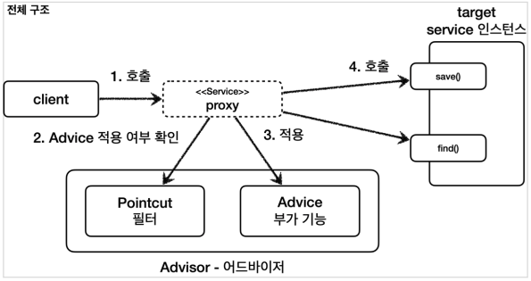
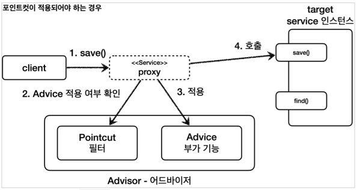
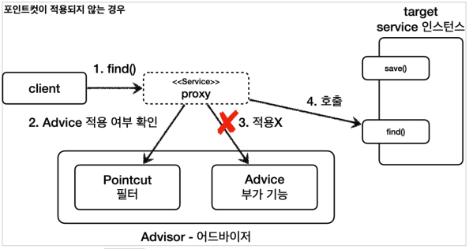

# 스프링이 지원하는 프록시

## 프록시 팩토리 - 소개

### 문제점

* 인터페이스가 있는 경우에는 JDK 동적 프록시를 적용하고, 그렇지 않은 경우에는 CGLIB를 적용하려면 어떻게 해야할까?
* 두 기술을 함께 사용할 때 부가 기능을 제공하기 위해
  JDK 동적 프록시가 제공하는 `InvocationHandler`와
  CGLIB가 제공하는 `MethodInterceptor`를 각각 중복으로 만들어서 관리해야 할까?
* 특정 조건에 맞을 때 프록시 로직을 적용하는 기능도 공통으로 제공되었으면?

### 프록시 팩토리

#### Q. 인터페이스가 있는 경우에는 JDK 동적 프록시를 적용하고, 그렇지 않은 경우에는 CGLIB를 적용하려면 어떻게 해야할까?


스프링은 유사한 구체적인 기술들이 있을 때,
그것들을 통합해서 일관성 있게 접근할 수 있고, 더욱 편리하게 사용할 수 있는 추상화된 기술을 제공한다.

스프링은 동적 프록시를 통합해서 편리하게 만들어주는 프록시 팩토리(`ProxyFactory`)라는 기능을 제공한다.

이전에는 상황에 따라서 JDK 동적 프록시를 사용하거나 CGLIB를 사용해야 했다면,
이제는 이 프록시 팩토리 하나로 편리하게 동적 프록시를 생성할 수 있다.

프록시 팩토리는 인터페이스가 있으면 JDK 동적 프록시를 사용하고,
구체 클래스만 있다면 CGLIB를 사용한다. 그리고 이 설정을 변경할 수도 있다.

### Advice

#### Q. 두 기술을 함께 사용할 때 부가 기능을 적용하기 위해 JDK 동적 프록시가 제공하는 `InvocationHandler`와 CGLIB가 제공하는 `MethodInterceptor`를 각각 중복으로 따로 만들어야 할까?


스프링은 이 문제를 해결하기 위해 부가 기능을 적용할 때 `Advice`라는 새로운 개념을 도입했다.
개발자는 `InvocationHandler`나 `MethodInterceptor`를 신경쓰지 않고, `Advice`만 만들면 된다.

결과적으로 `InvocationHandler`나 `MethodInterceptor`는 Advice 를 호출하게 된다.

프록시 팩토리를 사용하면 `Advice`를 호출하는 전용 `InvocationHandler`, `MethodInterceptor`를 내부에서 사용한다.

### Pointcut

#### Q. 특정 조건에 맞을 때 프록시 로직을 적용하는 기능도 공통으로 제공되었으면?

앞서 특정 메서드 이름의 조건에 맞을 때만 프록시 부가 기능이 적용되는 코드를 직접 만들었다.
스프링은 `Pointcut`이라는 개념을 도입해서 이 문제를 일관성 있게 해결한다.

## 프록시 팩토리 - 예제 코드 1

### Advice 만들기

`Advice`는 프록시에 적용하는 부가 기능 로직이다.

이것은 JDK 동적 프록시가 제공하는 `InvocationHandler`와 CGLIB가 제공하는 `MethodInterceptor`의 개념과 유사한다.
둘을 개념적으로 추상화 한 것이다. 프록시 팩토리를 사용하면 둘 대신에 `Advice` 를 사용하면 된다.

Advice 를 만드는 방법은 여러가지가 있지만, 기본적인 방법은 다음 인터페이스를 구현하면 된다.

#### MethodInterceptor Interface

```java
package org.aopalliance.intercept;

public interface MethodInterceptor extends Interceptor {
    Object invoke(MethodInvocation invocation) throws Throwable;
}
```

* `MethodInvocation`
    * 내부에는 다음 메서드를 호출하는 방법, 현재 프록시 객체 인스턴스, `args`, 메서드 정보 등이 포함되어 있다.
    * 기존에 파라미터로 제공되는 부분들이 이 안으로 모두 들어갔다고 생각하면 된다.
* `MethodInterceptor`는 `Interceptor`를 상속하고 `Interceptor`는 `Advice` 인터페이스를 상속한다.

### 예제

#### TimeAdvice

```java
/**
 * 스프링이 제공하는 {@link MethodInterceptor}을 사용해서 프록시를 생성<br>
 * - 타겟이 없다 -> {@link MethodInvocation}에 들어있다.<br>
 * - {@link MethodInvocation#proceed()}로 프록시를 호출하여 결과값을 받아온다.
 */
@Slf4j
public class TimeAdvice implements MethodInterceptor {

    @Override
    public Object invoke(
            MethodInvocation invocation
    ) throws Throwable {

        log.info("TimeProxy 실행");
        long startTime = System.currentTimeMillis();

        Object result = invocation.proceed();

        long endTime = System.currentTimeMillis();
        long resultTime = endTime - startTime;
        log.info("TimeProxy 종료 resultTime = [{}ms]", resultTime);

        return result;
    }
}
```

#### ProxyFactoryTest

```java
/**
 * {@link ProxyFactory} Test
 */
@Slf4j
public class ProxyFactoryTest {

    /**
     * {@link ProxyFactory} - JDK 동적 프록시 생성 테스트
     * <p>
     * 1. 프록시 팩토리 생성자에 타겟을 주입한다.<br>
     * 2. {@link ProxyFactory#addAdvice}에 프록시({@link MethodInterceptor})를 주입한다.
     * 3. {@link ProxyFactory#getProxy}로 프록시를 꺼내온다.
     * 4. {}
     */
    @Test
    @DisplayName("인터페이스가 있으면 JDK 동적 프록시 사용")
    public void interfaceProxy() {
        ServiceInterface target = new ServiceImpl();

        // 프록시 팩토리를 생성할 때 생성자에 타겟을 주입한다.
        ProxyFactory proxyFactory = new ProxyFactory(target);
        // addAdvice 메서드를 통해 어드바이스(프록시)를 주입한다.
        // "add" 이다. 이 말은 곧 여러 프록시를 등록할 수 있다는 뜻이다.
        proxyFactory.addAdvice(new TimeAdvice());

        // getProxy 메서드를 통해 프록시 팩토리의 프록시를 꺼내온다.
        ServiceInterface proxy = (ServiceInterface) proxyFactory.getProxy();

        // class hello.springcoreadvanced2.common.service.ServiceImpl
        log.info("targetClass = {}", target.getClass());
        // class jdk.proxy2.$Proxy9
        // 타겟이 Interface 이므로, JDK 동적 프록시를 사용한다.
        log.info("proxyClass = {}", proxy.getClass());

        // 프록시 호출
        proxy.save();

        // AopProxy 가 맞는지
        assertThat(AopUtils.isAopProxy(proxy)).isTrue();
        // JDK 동적 프록시가 맞는지
        assertThat(AopUtils.isJdkDynamicProxy(proxy)).isTrue();
        // CGLIB 프록시가 아닌지
        assertThat(AopUtils.isCglibProxy(proxy)).isFalse();
    }
}
```

## 프록시 팩토리 - 예제 코드 2

### 예제 1 - 구체 클래스는 CGLIB

```java
/**
 * {@link ProxyFactory} - CGLIB 프록시 생성 테스트
 * <p>
 * 1. 생성자에 타겟을 주입하는 것은 동일하다.
 * 2. 핸들러를 주입하는 것도 동일하다.
 * 3. 프록시를 꺼내오는 것도 동일하다.
 */
@Test
@DisplayName("구체 클래스만 있으면 CGLIB 사용")
public void concreteProxy() {
    ConcreteService target = new ConcreteService();

    // 프록시 팩토리를 생성할 때 생성자에 타겟을 주입한다.
    ProxyFactory proxyFactory = new ProxyFactory(target);
    proxyFactory.addAdvice(new TimeAdvice());

    // getProxy 메서드를 통해 프록시 팩토리의 프록시를 꺼내온다.
    ConcreteService proxy = (ConcreteService) proxyFactory.getProxy();

    // class hello.springcoreadvanced2.common.service.ServiceImpl
    log.info("targetClass = {}", target.getClass());
    // class hello.springcoreadvanced2.common.service.ConcreteService$$SpringCGLIB$$0
    // 타겟이 구체 클래스 이므로, CGLIB 프록시를 사용한다.
    log.info("proxyClass = {}", proxy.getClass());

    // 프록시 호출
    proxy.call();

    // AopProxy 가 맞는지
    assertThat(AopUtils.isAopProxy(proxy)).isTrue();
    // JDK 동적 프록시가 아닌지
    assertThat(AopUtils.isJdkDynamicProxy(proxy)).isFalse();
    // CGLIB 프록시가 맞는지
    assertThat(AopUtils.isCglibProxy(proxy)).isTrue();
}
```

### 예제 2

```java
/**
 * {@link ProxyFactory#setProxyTargetClass}에 true를 주면 무조건 CGLIB를 사용한다.
 */
@Test
@DisplayName("ProxyTargetClass 옵션을 사용하면 인터페이스가 있어도 CGLIB를 사용")
public void proxyTargetProxy() {
    ServiceInterface target = new ServiceImpl();

    ProxyFactory proxyFactory = new ProxyFactory(target);
    proxyFactory.addAdvice(new TimeAdvice());
    
    // 이 옵션을 주면 인터페이스의 여부와는 상관없이 CGLIB를 사용하여 프록시를 생성한다.
    proxyFactory.setProxyTargetClass(true);

    ServiceInterface proxy = (ServiceInterface) proxyFactory.getProxy();

    // class hello.springcoreadvanced2.common.service.ServiceImpl
    log.info("targetClass = {}", target.getClass());
    // class hello.springcoreadvanced2.common.service.ServiceImpl$$SpringCGLIB$$0
    log.info("proxyClass = {}", proxy.getClass());

    proxy.save();

    assertThat(AopUtils.isAopProxy(proxy)).isTrue();
    assertThat(AopUtils.isJdkDynamicProxy(proxy)).isFalse();
    assertThat(AopUtils.isCglibProxy(proxy)).isTrue();
}
```

### 정리

* 프록시 팩토리의 서비스 추상화 덕분에 구체적인 CGLIB, JDK 동적 프록시 기술에 의존하지 않고, 매우 편리하게 동적 프록시를 생성할 수 있다.

* **프록시의 부가 기능 로직도 특정 기술에 종속적이지 않게** `Advice` 하나로 편리하게 사용할 수 있었다.
    * 이것은 프록시 팩토리가 내부에서 JDK 동적 프록시인 경우 `InvocationHandler`가 `Advice`를 호출하도록 개발해두고,
      CGLIB인 경우 `MethodInterceptor`가 `Advice`를 호출하도록 기능을 개발해두었기 때문이다.

> **참고**<br>
> 스프링 부트는 AOP를 적용할 때 기본적으로 `proxyTargetClass = true`로 설정해서 사용한다.
> 따라서 인터페이스가 있어도 항상 CGLIB를 사용해서 구체 클래스를 기반으로 프록시를 생성한다.
> 자세한 이유는 강의 뒷 부분에서 설명한다.

## 포인트 컷, 어드바이스, 어드바이저 - 소개

### 소개

#### 포인트컷(`Pointcut`)

* **어디**에 부가 기능을 적용할지, 어디에 부가 기능을 적용하지 않을지 판단하는 **필터링 로직**이다.
* 주로 클래스와 메서드 이름으로 필터링 한다.
* 이름 그대로 어떤 포인트(Point)에 기능을 적용할지 하지 않을지 잘라서(cut) 구분하는 것이다.

#### 어드바이스(`Advice`)

* 이전에 본 것 처럼 프록시가 호출하는 부가 기능이다.
* 단순하게 **프록시 로직**이라 생각하면 된다.

#### 어드바이저(`Advisor`)

* 단순하게 하나의 포인트컷과 하나의 어드바이스를 가지고 있는 것이다.
* 쉽게 이야기해서 **포인트컷 1 + 어드바이스 1**이다.

### 정리



#### 쉽게 기억하기

* 조언(`Advice`)을 어디(`Pointcut`)에 할 것인가?
* 조언자(`Advisor`)는 어디(`Pointcut`)에 조언(`Advice`)을 해야할지 알고 있다.

#### 역할과 책임

> 이렇게 구분한 것은 **역할과 책임을 명확하게 분리**한 것이다.

* 포인트컷은 대상 여부를 확인하는 필터 역할만 담당한다.
* 어드바이스는 깔끔하게 부가 기능 로직만 담당한다.
* 둘을 합치면 어드바이저가 된다. 스프링의 어드바이저는 하나의 포인트컷 + 하나의 어드바이스로 구성된다.

#### 참고

> 참고<br>
> 해당 단어들에 대한 정의는 지금은 문맥상 이해를 돕기 위해 프록시에 맞추어서 설명하지만,
> 이후에 AOP 부분에서 다시 한번 AOP에 맞추어 정리하겠다.
>
> 그림은 이해를 돕기 위한 것이고, 실제 구현은 약간 다를 수 있다.

## 예제 코드 1 - 어드바이저

### 예제

#### AdvisorTest

```java
/**
 * {@link Advisor} Test
 */
public class AdvisorTest {

    /**
     * {@link Advisor} Test<br>
     * - {@link Pointcut#TRUE}:                    항상 True를 반환하는 포인트 컷<br>
     * - {@link DefaultPointcutAdvisor}:           {@link Advisor}의 일반적인 구현체<br>
     * - {@link ProxyFactory#addAdvisor(Advisor)}: 프록시 팩토리에 어드바이저 추가<br>
     * - {@link ProxyFactory#addAdvice(Advice)}:   내부에서 {@link Pointcut#TRUE}인 어드바이저를 생성
     *
     * @see Pointcut#TRUE
     * @see DefaultPointcutAdvisor
     * @see ProxyFactory#addAdvice(Advice)
     * @see ProxyFactory#addAdvisor(Advisor)
     */
    @Test
    void advisorTest1() {
        ServiceInterface target = new ServiceImpl();

        // 프록시 팩토리 생성
        ProxyFactory proxyFactory = new ProxyFactory(target);

        // 어드바이저 생성
        DefaultPointcutAdvisor advisor = new DefaultPointcutAdvisor(Pointcut.TRUE, new TimeAdvice());

        // 어드바이저 추가
        proxyFactory.addAdvisor(advisor);

        // 프록시 획득
        ServiceInterface proxy = (ServiceInterface) proxyFactory.getProxy();

        proxy.save();
        proxy.find();
    }
}
```

## 예제 코드 2 - 직접 만든 포인트 컷

### 포인트컷 관련 인터페이스 - 스프링 제공

```java
// 클래스 + 메서드 조건 필터
// 둘다 True를 반환해야 Advice로 이동된다.
public interface Pointcut {
    ClassFilter getClassFilter();
    MethodMatcher getMethodMatcher();
}

// 클래스 조건 필터
public interface ClassFilter {
    boolean matches(Class<?> clazz);
}

// 메서드 조건 필터
public interface MethodMatcher {
    boolean matches(Method method, Class<?> targetClass);
    //..
}
```

### 직접 만든 포인트 컷

#### MyMethodFilter

```java
/**
 * 메서드 이름을 기반으로 검증
 * - method.getName().equals("save")
 *
 * @see MethodMatcher
 */
@Slf4j
static class MyMethodMatcher implements MethodMatcher {
    private final String matchName = "save";

    /**
     * {@link MethodMatcher#isRuntime()} is false
     *
     * @param method      Reflection Method
     * @param targetClass 목표 오리지널 인스턴스
     * @return method.getName().equals(" save ")
     */
    @Override
    public boolean matches(Method method, Class<?> targetClass) {
        boolean result = method.getName().equals(matchName);
        log.info("포인트 컷 호출 method = {}, targetClass = {}", method.getName(), targetClass);
        log.info("포인트 컷 결과 result = {}", result);
        return result;
    }

    /**
     * true: None Caching <br>
     * -> {@link MethodMatcher#matches(Method, Class, Object...)}<br>
     * false: Caching <br>
     * -> {@link MethodMatcher#matches(Method, Class)}
     *
     * @return false
     */
    @Override
    public boolean isRuntime() {
        return false;
    }

    /**
     * {@link MethodMatcher#isRuntime()} is true
     *
     * @param method      Reflection Method
     * @param targetClass 목표 오리지널 인스턴스
     * @param args        동적으로 넘어오는 파라미터
     * @return false
     */
    @Override
    public boolean matches(Method method, Class<?> targetClass, Object... args) {
        return false;
    }
}
```

#### MyPointcut

```java
/**
 * 포인트 컷 직접 구현
 *
 * @see Pointcut
 * @see ClassFilter
 * @see MethodMatcher
 */
static class MyPointcut implements Pointcut {

    /**
     * 클래스 필터
     *
     * @return {@link ClassFilter#TRUE} 클래스 필터는 항상 통과한다.
     */
    @Override
    public ClassFilter getClassFilter() {
        return ClassFilter.TRUE;
    }

    /**
     * 메서드 필터
     *
     * @return {@link MyMethodMatcher}
     */
    @Override
    public MethodMatcher getMethodMatcher() {
        return new MyMethodMatcher();
    }
}
```

#### AdvisorTest

```java
/**
 * {@link MyPointcut} Test
 */
@Test
@DisplayName("직접 만든 포인트 컷")
void advisorTest2() {
    ServiceInterface target = new ServiceImpl();

    // 프록시 팩토리 생성
    ProxyFactory proxyFactory = new ProxyFactory(target);

    // 어드바이저 생성
    DefaultPointcutAdvisor advisor = new DefaultPointcutAdvisor(new MyPointcut(), new TimeAdvice());

    // 어드바이저 추가
    proxyFactory.addAdvisor(advisor);

    // 프록시 획득
    ServiceInterface proxy = (ServiceInterface) proxyFactory.getProxy();

    proxy.save();
    proxy.find();
}
```

### 그림으로 정리

#### 포인트컷 적용



* Advice 가 적용된다.

#### 포인트컷 미적용



* Advice 가 적용되지 않는다.

## 예제 코드 3 - 스프링이 제공하는 포인트 컷

## 예제 코드 4 - 여러 어드바이저 함께 적용

## 프록시 팩토리 - 적용 1

## 프록시 팩토리 - 적용 2