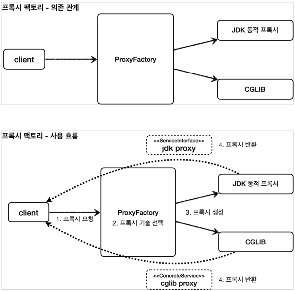
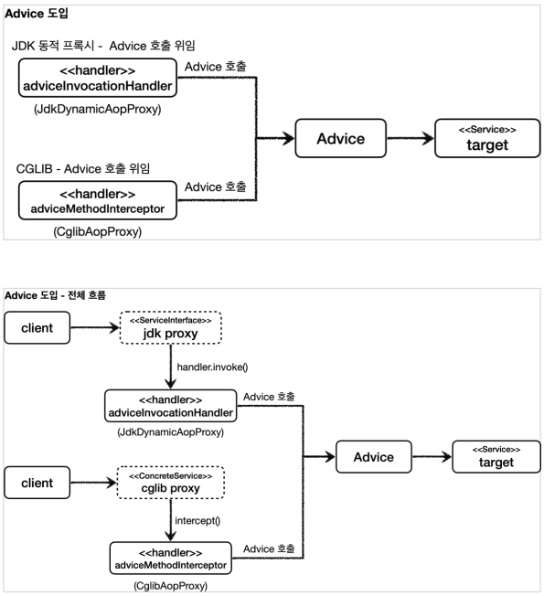

# 스프링이 지원하는 프록시

## 프록시 팩토리 - 소개

### 문제점

* 인터페이스가 있는 경우에는 JDK 동적 프록시를 적용하고, 그렇지 않은 경우에는 CGLIB를 적용하려면 어떻게 해야할까?
* 두 기술을 함께 사용할 때 부가 기능을 제공하기 위해
  JDK 동적 프록시가 제공하는 `InvocationHandler`와
  CGLIB가 제공하는 `MethodInterceptor`를 각각 중복으로 만들어서 관리해야 할까?
* 특정 조건에 맞을 때 프록시 로직을 적용하는 기능도 공통으로 제공되었으면?

### 프록시 팩토리

#### Q. 인터페이스가 있는 경우에는 JDK 동적 프록시를 적용하고, 그렇지 않은 경우에는 CGLIB를 적용하려면 어떻게 해야할까?



스프링은 유사한 구체적인 기술들이 있을 때,
그것들을 통합해서 일관성 있게 접근할 수 있고, 더욱 편리하게 사용할 수 있는 추상화된 기술을 제공한다.

스프링은 동적 프록시를 통합해서 편리하게 만들어주는 프록시 팩토리(`ProxyFactory`)라는 기능을 제공한다.

이전에는 상황에 따라서 JDK 동적 프록시를 사용하거나 CGLIB를 사용해야 했다면,
이제는 이 프록시 팩토리 하나로 편리하게 동적 프록시를 생성할 수 있다.

프록시 팩토리는 인터페이스가 있으면 JDK 동적 프록시를 사용하고,
구체 클래스만 있다면 CGLIB를 사용한다. 그리고 이 설정을 변경할 수도 있다.

### Advice

#### Q. 두 기술을 함께 사용할 때 부가 기능을 적용하기 위해 JDK 동적 프록시가 제공하는 `InvocationHandler`와 CGLIB가 제공하는 `MethodInterceptor`를 각각 중복으로 따로 만들어야 할까?



스프링은 이 문제를 해결하기 위해 부가 기능을 적용할 때 `Advice`라는 새로운 개념을 도입했다.
개발자는 `InvocationHandler`나 `MethodInterceptor`를 신경쓰지 않고, `Advice`만 만들면 된다.

결과적으로 `InvocationHandler`나 `MethodInterceptor`는 Advice 를 호출하게 된다.

프록시 팩토리를 사용하면 `Advice`를 호출하는 전용 `InvocationHandler`, `MethodInterceptor`를 내부에서 사용한다.

### Pointcut

#### Q. 특정 조건에 맞을 때 프록시 로직을 적용하는 기능도 공통으로 제공되었으면?

앞서 특정 메서드 이름의 조건에 맞을 때만 프록시 부가 기능이 적용되는 코드를 직접 만들었다.
스프링은 `Pointcut`이라는 개념을 도입해서 이 문제를 일관성 있게 해결한다.

## 프록시 팩토리 - 예제 코드 1

### Advice 만들기

`Advice`는 프록시에 적용하는 부가 기능 로직이다.

이것은 JDK 동적 프록시가 제공하는 `InvocationHandler`와 CGLIB가 제공하는 `MethodInterceptor`의 개념과 유사한다.
둘을 개념적으로 추상화 한 것이다. 프록시 팩토리를 사용하면 둘 대신에 `Advice` 를 사용하면 된다.

Advice 를 만드는 방법은 여러가지가 있지만, 기본적인 방법은 다음 인터페이스를 구현하면 된다.

#### MethodInterceptor Interface

```java
package org.aopalliance.intercept;

public interface MethodInterceptor extends Interceptor {
    Object invoke(MethodInvocation invocation) throws Throwable;
}
```

* `MethodInvocation`
    * 내부에는 다음 메서드를 호출하는 방법, 현재 프록시 객체 인스턴스, `args`, 메서드 정보 등이 포함되어 있다.
    * 기존에 파라미터로 제공되는 부분들이 이 안으로 모두 들어갔다고 생각하면 된다.
* `MethodInterceptor`는 `Interceptor`를 상속하고 `Interceptor`는 `Advice` 인터페이스를 상속한다.

### 예제

#### TimeAdvice

```java
/**
 * 스프링이 제공하는 {@link MethodInterceptor}을 사용해서 프록시를 생성<br>
 * - 타겟이 없다 -> {@link MethodInvocation}에 들어있다.<br>
 * - {@link MethodInvocation#proceed()}로 프록시를 호출하여 결과값을 받아온다.
 */
@Slf4j
public class TimeAdvice implements MethodInterceptor {

    @Override
    public Object invoke(
            MethodInvocation invocation
    ) throws Throwable {

        log.info("TimeProxy 실행");
        long startTime = System.currentTimeMillis();

        Object result = invocation.proceed();

        long endTime = System.currentTimeMillis();
        long resultTime = endTime - startTime;
        log.info("TimeProxy 종료 resultTime = [{}ms]", resultTime);

        return result;
    }
}
```

#### ProxyFactoryTest

```java
/**
 * {@link ProxyFactory} Test
 */
@Slf4j
public class ProxyFactoryTest {

    /**
     * {@link ProxyFactory} - JDK 동적 프록시 생성 테스트
     * <p>
     * 1. 프록시 팩토리 생성자에 타겟을 주입한다.<br>
     * 2. {@link ProxyFactory#addAdvice}에 프록시({@link MethodInterceptor})를 주입한다.
     * 3. {@link ProxyFactory#getProxy}로 프록시를 꺼내온다.
     * 4. {}
     */
    @Test
    @DisplayName("인터페이스가 있으면 JDK 동적 프록시 사용")
    public void interfaceProxy() {
        ServiceInterface target = new ServiceImpl();

        // 프록시 팩토리를 생성할 때 생성자에 타겟을 주입한다.
        ProxyFactory proxyFactory = new ProxyFactory(target);
        // addAdvice 메서드를 통해 어드바이스(프록시)를 주입한다.
        // "add" 이다. 이 말은 곧 여러 프록시를 등록할 수 있다는 뜻이다.
        proxyFactory.addAdvice(new TimeAdvice());

        // getProxy 메서드를 통해 프록시 팩토리의 프록시를 꺼내온다.
        ServiceInterface proxy = (ServiceInterface) proxyFactory.getProxy();

        // class hello.springcoreadvanced2.common.service.ServiceImpl
        log.info("targetClass = {}", target.getClass());
        // class jdk.proxy2.$Proxy9
        // 타겟이 Interface 이므로, JDK 동적 프록시를 사용한다.
        log.info("proxyClass = {}", proxy.getClass());

        // 프록시 호출
        proxy.save();

        // AopProxy 가 맞는지
        assertThat(AopUtils.isAopProxy(proxy)).isTrue();
        // JDK 동적 프록시가 맞는지
        assertThat(AopUtils.isJdkDynamicProxy(proxy)).isTrue();
        // CGLIB 프록시가 아닌지
        assertThat(AopUtils.isCglibProxy(proxy)).isFalse();
    }
}
```

## 프록시 팩토리 - 예제 코드 2

## 포인트 컷, 어드바이스, 어드바이저 - 소개

## 예제 코드 1 - 어드바이저

## 예제 코드 2 - 직접 만든 포인트 컷

## 예제 코드 3 - 스프링이 제공하는 포인트 컷

## 예제 코드 4 - 여러 어드바이저 함께 적용

## 프록시 팩토리 - 적용 1

## 프록시 팩토리 - 적용 2