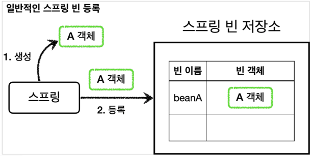
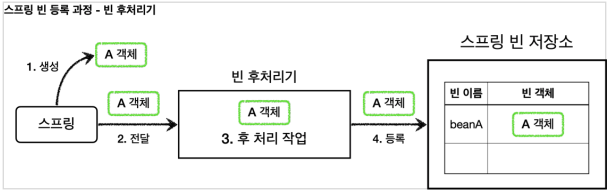
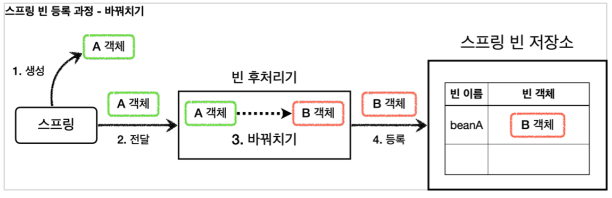
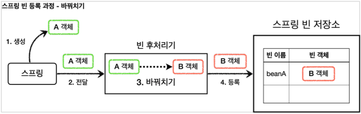
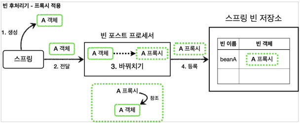
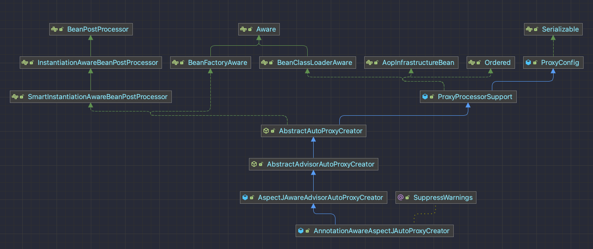
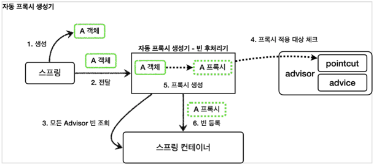
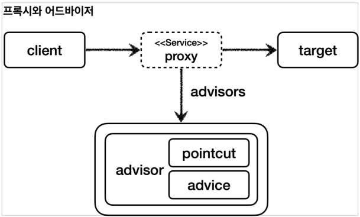

# 빈 후처리기

## 빈 후처리기 - 소개

### 일반적인 스프링 빈 등록



`@Bean`이나 컴포넌트 스캔으로 스프링 빈을 등록하면,
스프링은 대상 객체를 생성하고 스프링 컨테이너 내부의 빈 저장소에 등록한다.

그리고 이후에는 스프링 컨테이너를 통해 등록한 스프링 빈을 조회해서 사용하면 된다.

### 빈 후처리기

#### BeanPostProcessor

스프링이 빈 저장소에 등록할 목적으로 생성한 객체를
빈 저장소에 등록하기 직전에 조작하고 싶다면 빈 후처리기를 사용하면 된다.

빈 포스트 프로세서(`BeanPostProcessor`)는 번역하면 빈 후처리기인데,
이름 그대로 **빈을 생성한 후에 무언가를 처리하는 용도**로 사용한다.

#### 기능

* 객체 조작
* 다른 객체로 바꿔치기

#### 과정



1. **생성**
    * 스프링 빈 대상이 되는 객체를 생성한다. (`@Bean`, 컴포넌트 스캔 **모두 포함**)
2. **전달**
    * 생성된 객체를 빈 저장소에 등록하기 직전에 빈 후처리기에 전달한다.
3. **후 처리 작업**
    * 빈 후처리기는 전달된 스프링 빈 객체를 조작하거나 다른 객체로 바뀌치기 할 수 있다.
4. **등록**
    * 빈 후처리기는 빈을 반환한다.
    * 전달 된 빈을 그대로 반환하면 해당 빈이 등록되고, 바꿔치기 하면 다른 객체가 빈 저장소에 등록된다.

#### 다른 객체로 바꿔치기



## 빈 후처리기 - 예제 코드 1

### 일반적인 빈 등록


#### BasicTest

```java
public class BasicTest {
    @Test
    void basicConfig() {
        ApplicationContext context = new AnnotationConfigApplicationContext(BasicConfig.class);

        // A는 Bean으로 등록된다.
        A a = context.getBean("beanA", A.class);
        a.helloA();

        // B는 Bean으로 등록되지 않는다.
        Assertions.assertThrows(
                NoSuchBeanDefinitionException.class,
                () -> context.getBean(B.class)
        );
    }

    @Slf4j
    @Configuration
    static class BasicConfig {
        @Bean(name = "beanA")
        public A a() {
            return new A();
        }
    }

    @Slf4j
    static class A {
        public void helloA() {
            log.info("hello A");
        }
    }

    @Slf4j
    static class B {
        public void helloB() {
            log.info("hello B");
        }
    }
}
```

## 빈 후처리기 - 예제 코드 2

### 빈 후처리기 적용



#### BeanPostProcessor

```java
package org.springframework.beans.factory.config;

public interface BeanPostProcessor {

   /**
    * 객체 생성 이후, @PostConstruct 호출 전
    */
   @Nullable
   default Object postProcessBeforeInitialization(
            Object bean, 
            String beanName
   ) throws BeansException {
      return bean;
   }
   
   /**
    * 객체 생성 이후, @PostConstruct 호출 후
    */
   @Nullable
   default Object postProcessAfterInitialization(
            Object bean, 
            String beanName
   ) throws BeansException {
      return bean;
   }
}
```

### 테스트

#### BeanPostProcessorTest

```java
public class BeanPostProcessorTest {
    @Test
    void postProcessor() {
        ApplicationContext context = new AnnotationConfigApplicationContext(BasicConfig.class);

        // beanA 이름으로 B 객체가 Bean으로 등록된다.
        B b = context.getBean("beanA", B.class);
        b.helloB();

        // A는 Bean으로 등록되지 않는다.
        Assertions.assertThrows(
                NoSuchBeanDefinitionException.class,
                () -> context.getBean(A.class)
        );
    }

    @Slf4j
    @Configuration
    static class BasicConfig {
        @Bean(name = "beanA")
        public A a() {
            return new A();
        }

        /**
         * 빈 후처리기를 빈으로 등록
         */
        @Bean
        public AToBPostProcessor helloPostProcessor() {
            return new AToBPostProcessor();
        }
    }

    /**
     * 빈 후처리기 선언
     *
     * @see BeanPostProcessor
     */
    @Slf4j
    static class AToBPostProcessor implements BeanPostProcessor {

        /**
         * 객체 생성 이후, @PostConstruct 호출 이후
         *
         * @param bean     새로 생성되는 Bean 객체
         * @param beanName 해당 Bean 객체의 이름
         * @return {@link A} -> {@link B}
         * @throws BeansException 런타임 에러
         */
        @Override
        public Object postProcessAfterInitialization(
                Object bean,
                String beanName
        ) throws BeansException {
            log.info("beanName = {}, bean = {}", beanName, bean);
            return bean instanceof A ? new B() : bean;
        }
    }
}
```

#### 결과 로그

```
# 스프링 빈 컨텍스트 시작
[     AnnotationConfigApplicationContext] - Refreshing org.springframework.context.annotation.AnnotationConfigApplicationContext@2145b572

# 자동 빈 생성
[             DefaultListableBeanFactory] - Creating shared instance of singleton bean 'org.springframework.context.annotation.internalConfigurationAnnotationProcessor'
[             DefaultListableBeanFactory] - Creating shared instance of singleton bean 'org.springframework.context.event.internalEventListenerProcessor'
[             DefaultListableBeanFactory] - Creating shared instance of singleton bean 'org.springframework.context.event.internalEventListenerFactory'
[             DefaultListableBeanFactory] - Creating shared instance of singleton bean 'org.springframework.context.annotation.internalAutowiredAnnotationProcessor'
[             DefaultListableBeanFactory] - Creating shared instance of singleton bean 'org.springframework.context.annotation.internalCommonAnnotationProcessor'

# @Configuration의 빈 생성
[             DefaultListableBeanFactory] - Creating shared instance of singleton bean 'helloPostProcessor'
[             DefaultListableBeanFactory] - Creating shared instance of singleton bean 'beanPostProcessorTest.BasicConfig'

# BeanPostProcessor를 등록함에 따라 자동 프록시 등록이 해제 되었다.
[               BeanPostProcessorChecker] - Bean 'beanPostProcessorTest.BasicConfig' of type [hello.springcoreadvanced2.postprocessor.BeanPostProcessorTest$BasicConfig$$SpringCGLIB$$0] is not eligible for getting processed by all BeanPostProcessors (for example: not eligible for auto-proxying)

# A 객체의 빈 생성
[             DefaultListableBeanFactory] - Creating shared instance of singleton bean 'beanA'

# BeanPostProcessor#postProcessAfterInitialization 의 처리
# A 객체의 빈은 제거되고, B 객체의 빈으로 교체
[BeanPostProcessorTest$AToBPostProcessor] - beanName = beanA, bean = hello.springcoreadvanced2.postprocessor.BeanPostProcessorTest$A@1205bd62

# 테스트 코드 실행
[                BeanPostProcessorTest$B] - hello B
```

### 정리

빈 후처리기는 빈을 조작하고 변경할 수 있는 **후킹 포인트**이다.
이것은 빈 객체를 조작하거나 심지어 다른 객체로 바꾸어 버릴 수 있을 정도로 막강하다.
여기서 조작이라는 것은 해당 객체의 특정 메서드를 호출하는 것을 뜻한다.

일반적으로 스프링 컨테이너가 등록하는, 특히 컴포넌트 스캔의 대상이 되는 빈들은 중간에 조작할 방법이 없는데,
빈 후처리기를 사용하면 개발자가 등록하는 모든 빈을 중간에 조작할 수 있다.

이 말은 빈 객체를 **프록시로 교체**하는 것도 가능하다는 뜻이다.

#### @PostConstruct 의 비밀

`@PostConstruct`는 스프링 빈 생성 이후에 빈을 초기화 하는 역할을 한다.
그런데 생각해보면 빈의 초기화 라는 것이 단순히 `@PostConstruct` 애노테이션이 붙은 초기화 메서드를 한번 호출만 하면 된다.
쉽게 이야기해서 생성된 빈을 한번 조작하는 것이다.

따라서 빈을 조작하는 행위를 하는 적절한 빈 후처리기가 있으면 될 것 같다.

스프링은 `CommonAnnotationBeanPostProcessor`라는 빈 후처리기를 자동으로 등록하는데,
여기에서 `@PostConstruct`애노테이션이 붙은 메서드를 호출한다.

따라서 스프링 스스로도 스프링 내부의 기능을 확장하기 위해 빈 후처리기를 사용한다.

## 빈 후처리기 - 적용

### V3 적용



빈 후처리기를 사용해서 실제 객체 대신 프록시를 스프링 빈으로 등록해보자.
이렇게 하면 수동으로 등록하는 빈은 물론이고, 컴포넌트 스캔을 사용하는 빈까지 모두 프록시를 적용할 수 있다.

더 나아가서 설정 파일에 있는 수 많은 프록시 생성 코드도 한번에 제거할 수 있다.

### 예제 코드

#### PackageLogTraceProxyPostProcessor

```java
/**
 * 빈 후처리기를 사용해서 프록시를 등록
 *
 * @see BeanPostProcessor
 * @see BeanPostProcessor#postProcessAfterInitialization(Object, String)
 */
@Slf4j
@RequiredArgsConstructor
public class PackageLogTraceProxyPostProcessor implements BeanPostProcessor {

    private final String basePackage;
    private final Advisor advisor;

    /**
     * 빈 생성 -> @PostConstruct -> postProcessAfterInitialization
     *
     * @return 프록시 생성
     */
    @Override
    public Object postProcessAfterInitialization(
            Object bean,
            String beanName
    ) throws BeansException {
        log.info("[       param] beanName = {} bean = {}", beanName, bean);

        String packageName = bean.getClass().getPackageName();
        if (!packageName.startsWith(basePackage)) {
            return bean;
        }

        ProxyFactory proxyFactory = new ProxyFactory(bean);
        proxyFactory.addAdvisor(advisor);

        Object proxy = proxyFactory.getProxy();
        log.info("[create proxy] target = {} proxy = {}", bean.getClass(), proxy.getClass());

        return proxy;
    }
}
```

#### BeanPostProcessorConfig

```java
@Slf4j
@Configuration
@Import({AppV1Config.class, AppV2Config.class})
public class BeanPostProcessorConfig {

    /**
     * 빈 후처리기 등록
     */
    @Bean
    public PackageLogTraceProxyPostProcessor logTraceProxyPostProcessor(
            LogTrace logTrace
    ) {
        return new PackageLogTraceProxyPostProcessor(
                "hello.springcoreadvanced2.app",
                getAdvisor(logTrace)
        );
    }

    private Advisor getAdvisor(
            LogTrace logTrace
    ) {
        NameMatchMethodPointcut pointcut = new NameMatchMethodPointcut();
        pointcut.setMappedNames("request*", "order*", "save*");

        LogTraceAdvice advice = new LogTraceAdvice(logTrace);

        return new DefaultPointcutAdvisor(pointcut, advice);
    }
}
```

#### MainApplication

```java
@Import({
        LogTraceConfig.class,
        BeanPostProcessorConfig.class
})
@SpringBootApplication(scanBasePackages = "hello.springcoreadvanced2.app.v3")
public class ProxyApplication { ... }
```

### 결과 로그

```
# V3: CGLIB
[       param] beanName = orderRepositoryV3 bean = hello.springcoreadvanced2.app.v3.OrderRepositoryV3@35cd68d4
[create proxy] target = class hello.springcoreadvanced2.app.v3.OrderRepositoryV3 proxy = class hello.springcoreadvanced2.app.v3.OrderRepositoryV3$$SpringCGLIB$$0
[       param] beanName = orderServiceV3 bean = hello.springcoreadvanced2.app.v3.OrderServiceV3@7fd8c559
[create proxy] target = class hello.springcoreadvanced2.app.v3.OrderServiceV3 proxy = class hello.springcoreadvanced2.app.v3.OrderServiceV3$$SpringCGLIB$$0
[       param] beanName = orderControllerV3 bean = hello.springcoreadvanced2.app.v3.OrderControllerV3@18acfe88
[create proxy] target = class hello.springcoreadvanced2.app.v3.OrderControllerV3 proxy = class hello.springcoreadvanced2.app.v3.OrderControllerV3$$SpringCGLIB$$0

# V1: JDK 동적 프록시
[       param] beanName = orderRepositoryV1 bean = hello.springcoreadvanced2.app.v1.OrderRepositoryV1Impl@10bea4
[create proxy] target = class hello.springcoreadvanced2.app.v1.OrderRepositoryV1Impl proxy = class jdk.proxy2.$Proxy54
[       param] beanName = orderServiceV1 bean = hello.springcoreadvanced2.app.v1.OrderServiceV1Impl@64f1fd08
[create proxy] target = class hello.springcoreadvanced2.app.v1.OrderServiceV1Impl proxy = class jdk.proxy2.$Proxy55
[       param] beanName = orderControllerV1 bean = hello.springcoreadvanced2.app.v1.OrderControllerV1Impl@55e2fe3c
[create proxy] target = class hello.springcoreadvanced2.app.v1.OrderControllerV1Impl proxy = class jdk.proxy2.$Proxy56

# V2: CGLIB
[       param] beanName = orderRepositoryV2 bean = hello.springcoreadvanced2.app.v2.OrderRepositoryV2@2e807c54
[create proxy] target = class hello.springcoreadvanced2.app.v2.OrderRepositoryV2 proxy = class hello.springcoreadvanced2.app.v2.OrderRepositoryV2$$SpringCGLIB$$0
[       param] beanName = orderServiceV2 bean = hello.springcoreadvanced2.app.v2.OrderServiceV2@2b8bd798
[create proxy] target = class hello.springcoreadvanced2.app.v2.OrderServiceV2 proxy = class hello.springcoreadvanced2.app.v2.OrderServiceV2$$SpringCGLIB$$0
[       param] beanName = orderControllerV2 bean = hello.springcoreadvanced2.app.v2.OrderControllerV2@692e028d
[create proxy] target = class hello.springcoreadvanced2.app.v2.OrderControllerV2 proxy = class hello.springcoreadvanced2.app.v2.OrderControllerV2$$SpringCGLIB$$0
```

#### 컴포넌트 스캔에도 적용

여기서는 생략했지만, 실행해보면 스프링 부트가 기본으로 등록하는 수 많은 빈들이 빈 후처리기를 통과하는 것을 확인할 수 있다.
여기에 모두 프록시를 적용하는 것은 올바르지 않다. 꼭 필요한 곳에만 프록시를 적용해야 한다.

여기서는 `basePackage`를 사용해서 `v1 ~ v3` 애플리케이션 관련 빈들만 프록시 적용 대상이 되도록 했다.

## 빈 후처리기 - 정리

### 빈 후처리기 등장 이전의 문제점들

#### 문제1 - 너무 많은 설정

프록시를 직접 스프링 빈으로 등록하는 `ProxyFactoryConfigV1`, `ProxyFactoryConfigV2`와 같은 설정 파일은 프록시 관련 설정이 지나치게 많다는 문제가 있다.

예를 들어서 애플리케이션에 스프링 빈이 100개가 있다면 여기에 프록시를 통해 부가 기능을 적용하려면 100개의 프록시 설정 코드가 들어가야 한다.
무수히 많은 설정 파일 때문에 설정 지옥을 경험하게 될 것이다.

스프링 빈을 편리하게 등록하려고 컴포넌트 스캔까지 사용하는데, 이렇게 직접 등록하는 것도 모자라서,
프록시를 적용하는 코드까지 빈 생성 코드에 넣어야 했다.

#### 문제2 - 컴포넌트 스캔

애플리케이션 V3처럼 컴포넌트 스캔을 사용하는 경우 지금까지 학습한 방법으로는 프록시 적용이 불가능했다.

왜냐하면 컴포넌트 스캔으로 이미 스프링 컨테이너에 실제 객체를 스프링 빈으로 등록을 다 해버린 상태이기 때문이다.

좀 더 풀어서 설명하자면, 지금까지 학습한 방식으로 프록시를 적용하려면,
원본 객체를 스프링 컨테이너에 빈으로 등록하는 것이 아니라
`ProxyFactoryConfigV1`에서 한 것 처럼, 프록시를 원본 객체 대신 스프링 컨테이너에 빈으로 등록해야 한다.

그런데 컴포넌트 스캔은 원본 객체를 스프링 빈으로 자동으로 등록하기 때문에 프록시 적용이 불가능하다.

### 문제 해결

빈 후처리기 덕분에 프록시를 생성하는 부분을 하나로 집중할 수 있다.
그리고 컴포넌트 스캔처럼 스프링이 직접 대상을 빈으로 등록하는 경우에도 중간에 빈 등록 과정을 가로채서 원본 대신에 프록시를 스프링 빈으로 등록할 수 있다.

덕분에 애플리케이션에 수 많은 스프링 빈이 추가되어도 프록시와 관련된 코드는 전혀 변경하지 않아도 된다.
그리고 컴포넌트 스캔을 사용해도 프록시가 모두 적용된다.

#### 하지만 개발자의 욕심은 끝이 없다.

스프링은 프록시를 생성하기 위한 빈 후처리기를 이미 만들어서 제공한다

### 중요

프록시의 적용 대상 여부를 여기서는 간단히 패키지를 기준으로 설정했다.
그런데 잘 생각해보면 포인트컷을 사용하면 더 깔끔할 것 같다.

포인트컷은 이미 클래스, 메서드 단위의 필터 기능을 가지고 있기 때문에, 프록시 적용 대상 여부를 정밀하게 설정할 수 있다.

참고로 어드바이저는 포인트컷을 가지고 있다.
따라서 어드바이저를 통해 포인트컷을 확인할 수 있다.
뒤에서 학습하겠지만 **스프링 AOP는 포인트컷을 사용해서 프록시 적용 대상 여부**를 체크한다.

#### 결과적으로 포인트컷은 다음 두 곳에 사용된다.

1. 프록시 적용 대상 여부를 체크해서 꼭 필요한 곳에만 프록시를 적용한다.
    * 빈 후처리기 - 자동 프록시 생성
2. 프록시의 어떤 메서드가 호출 되었을 때 어드바이스를 적용할 지 판단한다.
    * 프록시 내부

## 스프링이 제공하는 빈 후처리기 1

### build.gradle

```gradle
dependencies {
    // 스프링 AOP
    implementation 'org.springframework.boot:spring-boot-starter-aop'
}
```

이 라이브러리를 추가하면 `aspectjweaver`라는 `aspectJ` 관련 라이브러리를 등록하고,
스프링 부트가 AOP 관련 클래스를 자동으로 스프링 빈에 등록한다.
스프링 부트가 없던 시절에는 `@EnableAspectJAutoProxy`를 직접 사용해야 했는데, 이 부분을 스프링 부트가 자동으로 처리해준다.

`aspectJ`는 뒤에서 설명한다. 스프링 부트가 활성화하는 빈은 `AopAutoConfiguration`를 참고하자.

### 자동 프록시 생성기 - AutoProxyCreator



* 앞서 이야기한 스프링 부트 자동 설정으로 `AnnotationAwareAspectJAutoProxyCreator` 라는 빈 후처리기가 스프링 빈에 자동으로 등록된다.
    * AspectJ 자동 프록시 생성기
* 이름 그대로 자동으로 프록시를 생성해주는 빈 후처리기이다.
* 이 빈 후처리기는 스프링 빈으로 등록된 `Advisor`들을 자동으로 찾아서 프록시가 필요한 곳에 자동으로 프록시를 적용해준다.
* `Advisor` 안에는 `Pointcut`과 `Advice`가 이미 모두 포함되어 있다.
    * 따라서 `Advisor`만 알고 있으면 그 안에 있는 `Pointcut`으로 어떤 스프링 빈에 프록시를 적용해야 할지 알 수 있다.
    * 그리고 `Advice`로 부가 기능을 적용하면 된다.

> **참고**<br>
> `AnnotationAwareAspectJAutoProxyCreator`는 `@AspectJ`와 관련된 AOP 기능도 자동으로 찾아서 처리해준다.
>
> `Advisor`는 물론이고, `@Aspect`도 자동으로 인식해서 프록시를 만들고 AOP를 적용해준다.
> `@Aspect`에 대한 자세한 내용은 뒤에 설명한다.

#### 작동 과정



1. 생성
    * 스프링이 스프링 빈 대상이 되는 객체를 생성한다.
    * `@Bean`, 컴포넌트 스캔 모두 포함
2. 전달
    * 생성된 객체를 빈 저장소에 등록하기 직전에 빈 후처리기에 전달한다.
3. 모든 `Advisor`빈 조회
    * 자동 프록시 생성기 - 빈 후처리기는 스프링 컨테이너에서 모든 `Advisor`를 조회한다.
4. 프록시 적용 대상 체크
    * 앞서 조회한 `Advisor`에 포함되어 있는 포인트컷을 사용해서 해당 객체가 프록시를 적용할 대상인지 아닌지 판단한다.
    * 이때 객체의 클래스 정보는 물론이고, 해당 객체의 모든 메서드를 포인트컷에 **하나하나** 모두 매칭해본다.
    * 그래서 조건이 하나라도 만족하면 프록시 적용 대상이 된다.
    * 예를 들어서 **10개의 메서드 중에 하나만 포인트컷 조건에 만족해도 프록시 적용 대상이 된다.**
5. 프록시 생성
    * 프록시 적용 대상이면 프록시를 생성하고 반환해서 프록시를 스프링 빈으로 등록한다.
    * 만약 프록시 적용 대상이 아니라면 원본 객체를 반환해서 원본 객체를 스프링 빈으로 등록한다.
6. 빈 등록
    * 반환된 객체는 스프링 빈으로 등록된다.

#### 생성된 프록시



### 예제

#### AutoProxyConfig

```java
/**
 * {@link AnnotationAwareAspectJAutoProxyCreator} 사용<br>
 * - 어드바이저만 스프링 빈으로 등록하면 자동 프록시 생성기가 프록시를 생성해준다.
 *
 * @see AnnotationAwareAspectJAutoProxyCreator
 */
@Configuration
@Import({AppV1Config.class, AppV2Config.class})
public class AutoProxyConfig {

    @Bean
    public Advisor advisor(LogTrace logTrace) {
        NameMatchMethodPointcut pointcut = new NameMatchMethodPointcut();
        pointcut.setMappedNames("request*", "order*", "save*");

        LogTraceAdvice advice = new LogTraceAdvice(logTrace);

        return new DefaultPointcutAdvisor(pointcut, advice);
    }
}
```

#### MainApplication

```java
@Import({
        LogTraceConfig.class,
        AutoProxyConfig.class
})
@SpringBootApplication(scanBasePackages = "hello.springcoreadvanced2.app.v3")
public class ProxyApplication { ... }
```

### 중요 - 포인트컷은 2가지에 사용된다.

#### 프록시 적용 여부 판단 - 생성 단계

* 자동 프록시 생성기는 포인트컷을 사용해서 해당 빈이 프록시를 생성할 필요가 있는지 없는지 체크한다.
* 클래스 + 메서드 조건을 모두 비교한다.
    * 이때 모든 메서드를 체크하는데, 포인트컷 조건에 하나하나 매칭해본다.
    * 만약 조건에 맞는 것이 하나라도 있으면 프록시를 생성한다.
        * 예) `orderControllerV1`은 `request()`, `noLog()`가 있다.
          여기에서 `request()`가 조건에 만족하므로 프록시를 생성한다.
* 만약 조건에 맞는 것이 하나도 없으면 프록시를 생성할 필요가 없으므로 프록시를 생성하지 않는다.

#### 어드바이스 적용 여부 판단 - 사용 단계

* 프록시가 호출되었을 때 부가 기능인 어드바이스를 적용할지 말지 포인트컷을 보고 판단한다.
* 앞서 설명한 예에서 `orderControllerV1`은 이미 프록시가 걸려있다.
    * `orderControllerV1`의 `request()`는 현재 포인트컷 조건에 만족하므로 프록시는 어드바이스를 먼저 호출하고, `target`을 호출한다.
    * `orderControllerV1`의 `noLog()`는 현재 포인트컷 조건에 만족하지 않으므로 어드바이스를 호출하지 않고 바로 `target`만 호출한다.

## 스프링이 제공하는 빈 후처리기 2

### 애플리케이션 로딩 로그

```
# order*
[6af6eae3] AppV1Config.orderControllerV1()
[6af6eae3] |-->AppV1Config.orderServiceV1()
[6af6eae3] |   |-->AppV1Config.orderRepositoryV1()
[6af6eae3] |   |<--AppV1Config.orderRepositoryV1() time = [0ms]
[6af6eae3] |<--AppV1Config.orderServiceV1() time = [1ms]
[6af6eae3] AppV1Config.orderControllerV1() time = [4ms]
[444db25a] AppV2Config.orderControllerV2()
[444db25a] |-->AppV2Config.orderServiceV2()
[444db25a] |   |-->AppV2Config.orderRepositoryV2()
[444db25a] |   |<--AppV2Config.orderRepositoryV2() time = [0ms]
[444db25a] |<--AppV2Config.orderServiceV2() time = [2ms]
[444db25a] AppV2Config.orderControllerV2() time = [3ms]

# request*
[ad228373] EnableWebMvcConfiguration.requestMappingHandlerAdapter()
[ad228373] EnableWebMvcConfiguration.requestMappingHandlerAdapter() time = [31ms]
[d50998a6] WebMvcConfigurationSupport.requestMappingHandlerMapping()
[d50998a6] WebMvcConfigurationSupport.requestMappingHandlerMapping() time = [2ms]
```

애플리케이션 서버를 실행해보면, 스프링이 초기화 되면서 기대하지 않은 이러한 로그들이 올라온다.
그 이유는 지금 사용한 포인트컷이 단순히 메서드 이름에 `"request*", "order*", "save*"` 만 포함되어 있으면 매칭 된다고 판단하기 때문이다.

결국 스프링이 내부에서 사용하는 빈에도 메서드 이름에 `request`라는 단어만 들어가 있으면 프록시가 만들어지고 되고, 어드바이스도 적용되는 것이다.

### AspectJExpressionPointcut

`AspectJ`라는 AOP에 특화된 **포인트컷 표현식**을 적용할 수 있다.

`AspectJ` 포인트컷 표현식과 AOP는 조금 뒤에 자세히 설명하겠다.
지금은 특별한 표현식으로 복잡한 포인트컷을 만들 수 있구나 라고 대략 이해하면 된다.

### 적용

#### AutoProxyConfig - advisor2

```java
@Configuration
@Import({AppV1Config.class, AppV2Config.class})
public class AutoProxyConfig {

    /**
     * {@link NameMatchMethodPointcut} Pointcut 사용
     */
    public Advisor advisor1(LogTrace logTrace) { ... }

    /**
     * {@link AspectJExpressionPointcut} Pointcut 사용
     */
    @Bean
    public Advisor advisor2(LogTrace logTrace) {
        final String aspectJString = "execution(* hello.springcoreadvanced2.app..*(..))";

        AspectJExpressionPointcut pointcut = new AspectJExpressionPointcut();
        pointcut.setExpression(aspectJString);

        LogTraceAdvice advice = new LogTraceAdvice(logTrace);

        return new DefaultPointcutAdvisor(pointcut, advice);
    }
}
```

* `AspectJExpressionPointcut`
    * AspectJ 포인트컷 표현식을 적용할 수 있다.
* `execution(* hello.proxy.app..*(..))`
    * AspectJ가 제공하는 포인트컷 표현식이다.
    * `execution([TYPE] [PACKAGE][METHOD][PARAM])`
    * `*`: 모든 반환 타입
    * `hello.proxy.app..`: 해당 패키지와 그 하위 패키지
    * `*(..)`: `*` 모든 메서드 이름, `(..)` 파라미터는 상관 없음

#### AutoProxyConfig - advisor3

```java
@Configuration
@Import({AppV1Config.class, AppV2Config.class})
public class AutoProxyConfig {

    /**
     * {@link NameMatchMethodPointcut} Pointcut 사용
     */
    public Advisor advisor1(LogTrace logTrace) { ... }

    /**
     * {@link AspectJExpressionPointcut} Pointcut 사용
     */
    public Advisor advisor2(LogTrace logTrace) { ... }

    /**
     * {@link AspectJExpressionPointcut} Pointcut 사용
     */
    @Bean
    public Advisor advisor3(LogTrace logTrace) {
        final String aspectJString = """
                    execution(* hello.springcoreadvanced2.app..*(..)) &&
                    !execution(* hello.springcoreadvanced2.app..noLog(..))
                """;

        AspectJExpressionPointcut pointcut = new AspectJExpressionPointcut();
        pointcut.setExpression(aspectJString);

        LogTraceAdvice advice = new LogTraceAdvice(logTrace);

        return new DefaultPointcutAdvisor(pointcut, advice);
    }
}
```

* `execution(* hello.proxy.app..*(..)) && !execution(* hello.proxy.app..noLog(..))`
    * `&&`: 두 조건을 모두 만족해야함
    * `!`: 반대

## 하나의 프록시, 여러 Advisor 적용

### 프록시 생성


예를 들어서 어떤 스프링 빈이 `advisor1`, `advisor2`가 제공하는
포인트컷의 조건을 모두 만족하면 프록시 자동 생성기는 프록시를 몇 개 생성할까?

프록시 자동 생성기는 프록시를 **하나만 생성**한다.
왜냐하면 프록시 팩토리가 생성하는 프록시는 내부에 여러 `advisor`들을 포함할 수 있기 때문이다.
따라서 프록시를 여러 개 생성해서 비용을 낭비할 이유가 없다.

#### 프록시 자동 생성기 상황별 정리

* `advisor1`의 포인트컷만 만족
    * 프록시 1개 생성, 프록시에 `advisor1`만 포함
* `advisor1`, `advisor2`의 포인트컷을 모두 만족
    * 프록시 1개 생성, 프록시에 `advisor1`, `advisor2` 모두 포함
* `advisor1`, `advisor2`의 포인트컷을 모두 만족하지 않음
    * 프록시가 생성되지 않음